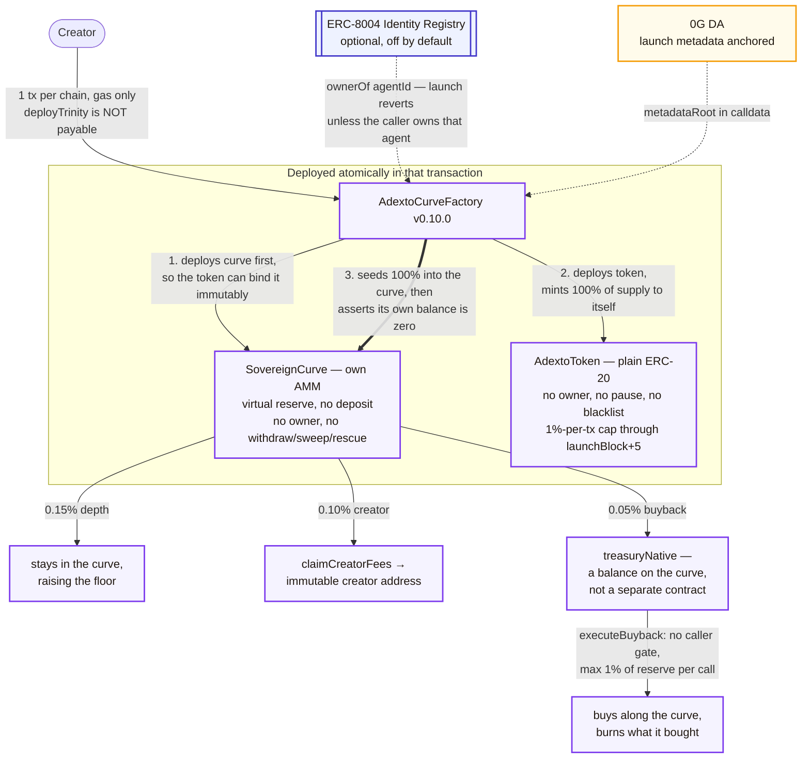

# ADEXTO Protocol (`adexto.xyz`)

> **Autonomous Decentralized EXchange & Token Orchestrator**
> Launch an agent-bound ERC-20 on its own bonding curve with no liquidity deposit — gas only — on 0G, Base, Arbitrum or Monad.

[](https://adexto.xyz)
[](contracts/)
[](#erc-8004-agent-identity)
[](#-mainnet-deployments)
[](https://adexto-x402-edge.cucuvirtual.workers.dev/v1/x402/adexto)

---

## What this is

A creator launches a token and it opens **inside a bonding curve against a virtual reserve**. There is nothing to seed, so a launch costs gas and nothing else. 100% of supply enters the curve, so the creator holds no allocation to sell. Income arrives instead as a share of every swap, taken from inside the existing fee rather than added on top of it.

The curve is the permanent venue. There is **no graduation step** and no migration into an external pool, which is where most launchpad exploits have historically happened. There is also no withdrawal function anywhere in the curve, so no one — including us — can drain a market.

To be precise about what that does and does not mean: it describes what the protocol does, not a restriction on the token. `AdextoToken` enforces a 1%-of-supply per-transaction cap only while `block.number <= launchBlock + 5`; after that window `_update` adds no condition at all, and there is no blacklist, no pause, no `Ownable` and no permanent transfer hook. It is a plain ERC-20. So **anyone can list one of these tokens on any external AMM, without our permission, and we could not stop it.** A second market with its own price could therefore exist alongside the curve. What the protocol guarantees is narrower and worth stating plainly: *we* never migrate the market, and nobody can withdraw the curve's own reserves.

### Fee split

One 0.30% swap fee, divided three ways on-chain. Traders are never charged extra to pay the creator.

| Share | Bps | Goes to |
|---|---|---|
| Depth | 0.15% | stays in the curve, raising the price floor as volume accumulates |
| Creator | 0.10% | streamed to the creator's wallet on every swap |
| Buyback | 0.05% | accrues on the curve as `treasuryNative`; a buyback call spends it on the curve and burns what it bought |

The studio offers three presets (0.10% / 0.30% / 0.50% total) and the table shows the 0.30% standard one, but the preset list is UI only — the contract accepts any split subject to `swapFeeBps <= 500`. Depth is the residual, not an input: the factory computes `swapFeeBps − creatorShareBps − treasuryShareBps` and the curve re-checks the sum against its own 5% ceiling, so the three shares cannot exceed the total.

Two details about the buyback share, because "buyback" usually implies more than this one does. It is **permissionless** — `executeBuyback` carries only `nonReentrant` and `live`, so any address may call it, capped at 1% of the native reserve per call. And the native never leaves the contract: the call moves `treasuryNative` into the curve reserve and burns the tokens that purchase bought, so the effect is a permanent supply reduction rather than a payment to anyone. `agentTreasury` on the curve is a reference field and receives nothing, ever.

---

## ⚙️ What one launch creates



Three things in that picture are worth separating from the launch path, because they are real but they are not part of `deployTrinity`:

- **`agentIdentity` is just an address.** It is required non-zero and stored immutably on both the token and the curve, and it may call `executeTreasuryBuyback` to burn tokens it holds itself. It is not automatically the 0G Compute agent — the studio passes the creator's own wallet by default.
- **The 0G Compute agent and the x402 edge are not wired into the curve.** The agent is an inference route; the x402 worker answers an HTTP 402 quote. Neither holds a key to anything on-chain, and neither can move the buyback balance. An earlier version of this diagram drew an arrow from the worker into the vault, which implied a settlement path that has never existed in the code.
- **The buyback burns, but nobody is in charge of it.** `executeBuyback` carries only `nonReentrant` and `live` — no caller gate — so anyone may trigger it, bounded to 1% of the reserve per call.

---

## 🏛️ Mainnet deployments

Every address below was confirmed to hold bytecode by a direct `eth_getCode` call against the chain's RPC. Testnet deployments are deliberately not listed here — they belong in the operator runbook, not in the public README.

`AdextoCurveFactory` `0.10.0` is the current, executable generation: it deploys the token and its curve in one transaction, needs no liquidity deposit, and can bind an ERC-8004 agent identity. Its runtime bytecode is **byte-identical across all four chains (20,054 bytes)** and reproducible from source with `node scripts/compile-contracts.mjs --via-ir`.

`0.9.0` is listed alongside it because it is **still deployed and still permissionless** — superseding it in the UI does not remove it from the chain. It is a different generation with a different `deployTrinity` selector and no `AGENT_REGISTRY`, so the two must not be confused. Each row below states its `VERSION` as read from the contract.

### 0G Mainnet · chain ID 16661

| Contract | Address | Notes |
|---|---|---|
| **AdextoCurveFactory** | [`0xaA85bc0cceB35B524b6BB730612540Fb88df0f8e`](https://chainscan.0g.ai/address/0xaA85bc0cceB35B524b6BB730612540Fb88df0f8e) | **current** · `VERSION` `0.10.0` · 20,054 B · block 43173642 |
| AdextoCurveFactory | [`0x090a586Abfaad1eee258Fc15e8E4584B5c3B67d5`](https://chainscan.0g.ai/address/0x090a586Abfaad1eee258Fc15e8E4584B5c3B67d5) | superseded · `VERSION` `0.9.0` · 18,460 B · block 43164332 · still live |
| AdextoGovernor | [`0x5045b117dDF788078c535f37837fDB6384da034d`](https://chainscan.0g.ai/address/0x5045b117dDF788078c535f37837fDB6384da034d) | **not operational** · `governanceToken` points at the v1 hook, which has no `balanceOf` |
| ERC-8004 agent (ours) | [`3545431`](https://chainscan.0g.ai/address/0x8004A169FB4a3325136EB29fA0ceB6D2e539a432) | registered, owned by the deployer · id is chain-specific |
| AdextoTrinityFactory | [`0xe8E9Cf43f88D065892c35c4aDa002C7B8b11F3e0`](https://chainscan.0g.ai/address/0xe8E9Cf43f88D065892c35c4aDa002C7B8b11F3e0) | superseded v1 |
| SovereignHook | [`0x592c697aD1Fa712c6701C90991B96264aB2E98d8`](https://chainscan.0g.ai/address/0x592c697aD1Fa712c6701C90991B96264aB2E98d8) | superseded v1, cannot settle trades |

### Base Mainnet · chain ID 8453

| Contract | Address | Notes |
|---|---|---|
| **AdextoCurveFactory** | [`0x2674654D4a8B79f84c1daC4Cf254EA066e59bC56`](https://basescan.org/address/0x2674654D4a8B79f84c1daC4Cf254EA066e59bC56) | **current** · `VERSION` `0.10.0` · 20,054 B · block 50712524 |
| AdextoCurveFactory | [`0xbC72FE919F85E679e7d95e2b471AaDA3c7c3Ac39`](https://basescan.org/address/0xbC72FE919F85E679e7d95e2b471AaDA3c7c3Ac39) | superseded · `VERSION` `0.9.0` · 18,460 B · block 50708028 · still live |
| AdextoGovernor | [`0x01b250a2db25561dB185f4628B93C72048D8bc1B`](https://basescan.org/address/0x01b250a2db25561dB185f4628B93C72048D8bc1B) | **not operational** · `governanceToken` is the zero address |
| ERC-8004 agent (ours) | [`84622`](https://basescan.org/address/0x8004A169FB4a3325136EB29fA0ceB6D2e539a432) | registered, owned by the deployer · id is chain-specific |
| AdextoTrinityFactory | [`0x8e63e117E71A80Cfc10fDF375F079e2e29cd7D7D`](https://basescan.org/address/0x8e63e117E71A80Cfc10fDF375F079e2e29cd7D7D) | superseded v1 |
| SovereignHook | [`0xb264D861264B0e4f8fb98A61B7694BA8a3B6BBe3`](https://basescan.org/address/0xb264D861264B0e4f8fb98A61B7694BA8a3B6BBe3) | superseded v1, cannot settle trades |

### Arbitrum One · chain ID 42161

| Contract | Address | Notes |
|---|---|---|
| **AdextoCurveFactory** | [`0x8F3948902c48489fc9E7287590E7eb8A8E915A64`](https://arbiscan.io/address/0x8F3948902c48489fc9E7287590E7eb8A8E915A64) | **current** · `VERSION` `0.10.0` · 20,054 B · block 500429767 |
| AdextoCurveFactory | [`0x795D11BEAc025771e9e96Bb4489068b1eDC4b47a`](https://arbiscan.io/address/0x795D11BEAc025771e9e96Bb4489068b1eDC4b47a) | superseded · `VERSION` `0.9.0` · 18,460 B · block 500393825 · still live |
| AdextoGovernor | [`0x33811F9c53da5071A130F18D844f64999dBD43bA`](https://arbiscan.io/address/0x33811F9c53da5071A130F18D844f64999dBD43bA) | **not operational** · `governanceToken` points at the v1 hook, which has no `balanceOf` |
| ERC-8004 agent (ours) | [`1457`](https://arbiscan.io/address/0x8004A169FB4a3325136EB29fA0ceB6D2e539a432) | registered, owned by the deployer · id is chain-specific |
| AdextoTrinityFactory | [`0x2674654D4a8B79f84c1daC4Cf254EA066e59bC56`](https://arbiscan.io/address/0x2674654D4a8B79f84c1daC4Cf254EA066e59bC56) | superseded v1 |
| SovereignHook | [`0xbC72FE919F85E679e7d95e2b471AaDA3c7c3Ac39`](https://arbiscan.io/address/0xbC72FE919F85E679e7d95e2b471AaDA3c7c3Ac39) | superseded v1, cannot settle trades |

### Monad Mainnet · chain ID 143

| Contract | Address | Notes |
|---|---|---|
| **AdextoCurveFactory** | [`0xbC72FE919F85E679e7d95e2b471AaDA3c7c3Ac39`](https://monadvision.com/address/0xbC72FE919F85E679e7d95e2b471AaDA3c7c3Ac39) | **current** · `VERSION` `0.10.0` · 20,054 B · block 100872196 |
| AdextoCurveFactory | [`0x05EFA7F066FcbefbE650EDd58583C107831A600B`](https://monadvision.com/address/0x05EFA7F066FcbefbE650EDd58583C107831A600B) | superseded · `VERSION` `0.9.0` · 18,460 B · block 100842422 · still live |
| AdextoGovernor | [`0x01b250a2db25561dB185f4628B93C72048D8bc1B`](https://monadvision.com/address/0x01b250a2db25561dB185f4628B93C72048D8bc1B) | **not operational** · `governanceToken` is the zero address |
| ERC-8004 agent (ours) | [`10247`](https://monadvision.com/address/0x8004A169FB4a3325136EB29fA0ceB6D2e539a432) | registered, owned by the deployer · id is chain-specific |
| AdextoTrinityFactory | [`0x8e63e117E71A80Cfc10fDF375F079e2e29cd7D7D`](https://monadvision.com/address/0x8e63e117E71A80Cfc10fDF375F079e2e29cd7D7D) | superseded v1 |
| SovereignHook | [`0xb264D861264B0e4f8fb98A61B7694BA8a3B6BBe3`](https://monadvision.com/address/0xb264D861264B0e4f8fb98A61B7694BA8a3B6BBe3) | superseded v1, cannot settle trades |

> Some addresses repeat across chains, and one repeats three times. That is expected, not a copy-paste error: `CREATE` derives an address from the deployer and its nonce, so the same deployer at the same nonce lands on the same address on every EVM chain. `0xbC72FE919F85E679e7d95e2b471AaDA3c7c3Ac39` is the **superseded 0.9.0 factory on Base**, the **current 0.10.0 factory on Monad**, and the **v1 hook on Arbitrum** — three different contracts at one address on three different chains, each confirmed by reading `VERSION` and the bytecode size from that chain. Always check the chain before trusting an address here.

**Deployer:** `0x8a3c7524Aaed081825aC88eC7f4cCECFc583ee7D`

---

## 📋 Honest status

The point of this table is that nothing above it should be read as more finished than it is.

| Component | State | What that means precisely |
|---|---|---|
| `AdextoCurveFactory` `0.10.0` on 4 mainnets | **Live** | Broadcast and read back on each chain: `VERSION` `0.10.0`, `totalProjectsCount` 0, runtime bytecode byte-identical to a local compile (20,054 B), and `AGENT_REGISTRY` resolving to a live ERC-8004 registry answering `name()`. |
| `AdextoCurveFactory` `0.9.0` on 4 mainnets | **Live, superseded** | Still deployed and still permissionless. Superseded because `0.10.0` adds the ERC-8004 binding, which changes the `deployTrinity` selector. Both generations are listed in the tables above so nobody mistakes one for the other. |
| ERC-8004 agent identity | **Optional, verified on-chain** | See [below](#erc-8004-agent-identity). Identity registry only; reputation and validation are not used. |
| Launching through the site | **Enabled** | All four `NEXT_PUBLIC_CURVE_FACTORY_*` are set to the `0.10.0` addresses above, so the studio can launch. This row said "not enabled" for a while after it stopped being true. |
| Tokens launched | **Zero on the curve factories** | `totalProjectsCount()` returns 0 on `0.10.0` and on `0.9.0`, on all four chains. One caveat rather than a round number: the superseded v1 `AdextoTrinityFactory` on 0G reports **1**, from before this generation. The market index reads the curve generation and is empty. |
| Trading / swap | **No markets yet** | Follows from the line above: nothing has launched through the curve factory, so there is nothing to trade. The factory itself is live. |
| Own AMM (`SovereignCurve`) | **Deployed per launch** | The curve ships with the factory. Proven end-to-end on four testnets; no mainnet launch has happened yet. |
| Agent compute (0G) | **Live, partially attested** | The 0G router reports Intel TDX attestation via dstack for each model we call. We read that declaration; we do **not** fetch or verify the raw quote. |
| x402 edge gateway | **Discovery only** | The HTTP 402 challenge, price and settlement vault are live and real. EIP-712 voucher settlement and revenue routing into the vault are **not built** — a signed voucher returns 501. |
| 0G DA metadata anchoring | **Live** | Launch metadata is anchored and its storage root travels in calldata as `metadataRoot`. |
| The Graph indexing | **Wired, with nothing to index yet** | `adexto-base` and `adexto-arbitrum` are live at `v0.10.2` and `SUBGRAPH_URL_*` now points at both. Verified reachable from the app: Base at block 50,862,947 and Arbitrum at 501,625,052, `hasIndexingErrors: false` on each. The registry stays the primary source and the indexer is additive, so an empty indexer only leaves `live` null. Because the route asks only about curves the registry already knows, and the registry is empty, no query is actually issued yet. Not published to the decentralized network. See below. |
| Governance | **Deployed, NOT operational** | Stronger than "unexercised": it cannot be exercised. `castVote` weighs a ballot with `governanceToken.balanceOf(msg.sender)`, and that address is the zero address on Base and Monad, and the superseded v1 hook — which has no `balanceOf` — on 0G and Arbitrum. Every vote would revert. `proposalCount` is 0 on all four. |

### A claim this file used to make

One claim was carried in this README for a long time and was not true when it was written. It is recorded here rather than quietly deleted, because a corrected file that hides its corrections asks to be trusted on nothing but its current wording.

- **~~ERC-8004 compliance.~~** This was false and is now partly true; see [ERC-8004 agent identity](#erc-8004-agent-identity) below for exactly how far it goes. Until factory `0.10.0`, `AdextoToken` was `ERC20` and nothing more, carrying one `address immutable agentIdentity` and touching no registry — so the claim was unsupportable and the source called it "ERC-8004 style", an analogy. A launch can now bind a real agent id, verified on-chain. The reputation and validation registries are still not used.

### Why a bonding curve rather than a liquidity pool

The reason is the launch model, and it is checkable in the contracts rather than a matter of taste.

| | this curve | a standard liquidity pool |
|---|---|---|
| Capital to open a market | none — the native side starts entirely virtual, and `deployTrinity` is not `payable`, so it cannot accept a deposit | real liquidity must be deposited by someone |
| Creator's token position | none — the whole supply is minted to the factory and loaded into the curve in the same transaction, and the factory then requires its own balance to be zero before the launch can succeed | the creator must hold tokens to pair with liquidity |
| Can reserves be pulled out | no — there is no `withdraw`, `rescue`, `sweep`, `drain` or `emergency` function anywhere, no owner and no `onlyOwner`; native leaves through exactly two paths, a seller's payout and the creator's fee claim to an immutable address | yes, and correctly so: a provider may withdraw at any time |
| Migration step | none — the curve is the permanent venue | the usual launchpad pattern graduates a curve into a pool, and that step is where much of the historical exploit surface lives |
| Creator fee | 0.10% of every swap accrues on-chain inside the existing 0.30% | fees accrue to liquidity providers; paying a creator needs custom hook support the venue may not offer |
| Code paths across our four chains | one, byte-identical | whatever venue happens to exist per chain |

The third row is the substantive one. That a liquidity provider can withdraw is not a flaw — it is what an AMM is for. But it means the venue can be removed from under holders, and "we won't" is a promise. Here the same guarantee comes from the absence of code that could do it.

### ERC-8004 agent identity

Optional, off by default, and real when switched on. A launch may bind the token to an agent registered in the [ERC-8004](https://eips.ethereum.org/EIPS/eip-8004) Identity Registry, and `AdextoCurveFactory` calls `ownerOf(agentId)` and refuses the launch unless the caller owns that agent — so a token cannot attach itself to somebody else's identity and inherit its reputation.

| | |
|---|---|
| Identity Registry | `0x8004A169FB4a3325136EB29fA0ceB6D2e539a432` — same address on all four mainnets, verified answering `ownerOf` |
| Our own agent | **registered on all four mainnets** — Base `84622`, Arbitrum One `1457`, 0G `3545431`, Monad `10247`, all owned by the deployer |
| Registry on testnets | **absent**, so the agent path can only be exercised on mainnet or a local devchain |
| Standard status | **Draft**. The registry proxy is upgradeable and controlled by a third party |
| Reputation / Validation registries | **not used** |
| Read on a token | `agentBound()`, then `agentId()` and `agentRegistry()` |

Four things worth knowing before relying on it.

**An agent id means nothing without its chain.** The registry sits at one address on all four mainnets, which invites the assumption that an id is global. It is not — each registry keeps its own state, and `ownerOf(0)` returns three *different* owners across the four chains. Our own registrations came back `84622` on Base, `1457` on Arbitrum, `3545431` on 0G and `10247` on Monad for the same agent. Launching four chains with one id binds on the chain it came from and reverts on the rest with `Factory: agent not owned by caller`, after gas has been spent on each. Register once per chain and pass that chain's id.

**Binding is a separate step from launching.** ERC-8004 wants the registration file to contain its own `agentId`, and the id does not exist until `register()` returns — so a file pinned beforehand cannot contain it. The creator registers first and passes the id to the launch. Leaving the identity off keeps the launch at one transaction, which is why the gas-only property is unaffected.

**`agentBound()` is the flag to read, not `agentId()`.** Agent id 0 is a real agent with a real owner on 0G, Base, Arbitrum One and Monad, so zero cannot mean "no agent". An earlier revision of this used `agentId == 0` as that sentinel; testing against the live registries caught it before it was frozen into immutable bytecode.

**The registration file is `data:` until IPFS pinning is configured.** ERC-8004 permits a base64 `data:` URI for fully on-chain metadata, and that is the default here because an `ipfs://` CID that nobody pins is a dead link recorded permanently. Set `PINATA_JWT` to pin instead; the CID is recomputed locally and compared with what the service reports. This matters: an empirical study of ERC-8004 found most registrations are placeholders with no live endpoint ([arXiv 2606.26028](https://arxiv.org/html/2606.26028)), and reading agent #40 on our own four chains shows an empty string on 0G, un-encoded raw JSON on Monad, and an HTTPS URL whose embedded id does not match the token on Base.

The script reads the id out of the mint `Transfer` event rather than assuming ids are sequential, then calls `setAgentURI` with a rebuilt file that contains that id.

```bash
node scripts/register-agent-8004.mjs --chain base              # dry run, no gas
node scripts/register-agent-8004.mjs --chain base --broadcast   # registers, then sets the URI
node scripts/test-erc8004-binding.mjs                          # 24 assertions, local devchain
```

Registering on all four cost roughly $0.10 in total across eight transactions.

### The Graph

Deployed for two chains, and **not yet read by this site**. The manifest and per-network config are generated from `subgraph/chains.json` plus `build/deployments.json` (`npm run networks` in `subgraph/`).

| Subgraph | Version | Endpoint |
|---|---|---|
| `adexto-base` | `v0.10.2` | `https://api.studio.thegraph.com/query/1757874/adexto-base/v0.10.2` |
| `adexto-arbitrum` | `v0.10.2` | `https://api.studio.thegraph.com/query/1757874/adexto-arbitrum/v0.10.2` |

`v0.10.1` fixed a unit mismatch where `openingPriceNative` was a 1e18-scaled `BigInt` beside a decimal `spotPriceNative`. `v0.10.2` corrects the manifest description, which claimed "agent buyback burns" — `executeBuyback` has no caller gate at all, so anyone may trigger it and attributing it to an agent overstated what the contract enforces. The same version also stopped omitting the ERC-8004 `AgentBound` binding, which the subgraph indexes and the description had never mentioned.

Both index factory `0.10.0` including the `AgentBound` event, and both were verified rather than assumed: `hasIndexingErrors: false`, and each has indexed **past its factory's start block** — 142,769 blocks on Base and 1,134,799 on Arbitrum. That last check is the one that matters. A subgraph aimed at the *wrong* factory also reports healthy and also returns nothing, and looks identical to a correct one; only having passed the right start block makes an empty result mean "nothing has launched" rather than "watching the wrong address".

`SUBGRAPH_URL_*` **is now set** for both. It was held back on the reasoning that pointing the app at an endpoint which had never indexed a launch would replace direct chain reads with an indexer that has nothing to say. That reasoning was wrong about this codebase: `src/app/api/graphql/route.ts` treats the registry as the primary source and the indexer as additive, so an empty or unreachable indexer only leaves `live` null. Wiring it early also means the indexer path is exercised before a demo instead of during one.

One consequence worth knowing: the route asks an indexer only about curves the registry already knows, so with an empty registry no query is issued at all and `chainsReachable` reads `0/0`. Reachability was therefore proven separately, by adding two throwaway registry rows locally to force the request — Base answered at block 50,862,947 in 334 ms and Arbitrum at 501,625,052 in 405 ms, both with `hasIndexingErrors: false` and zero curves, which is the correct answer for addresses that do not exist.

Nothing is published to the decentralized network. That is a separate decision, and publishing alone would not make the subgraph serve queries: issuance is distributed to indexers in proportion to curation signal, so a subgraph with a token amount of signal gives an indexer no reason to index it. The Graph's own recent GIPs state that the signal required and the indexing response it produces are unpredictable, which is why they are building direct indexing agreements. The Studio endpoints above serve queries today without any of that.

Two of the four chains cannot use Subgraph Studio at all, which is a property of The Graph and not a choice:

| Chain | Target | Reason |
|---|---|---|
| Base, Arbitrum One | Subgraph Studio | Subgraphs served, indexing rewards enabled — **deployed, see above** |
| 0G Mainnet | Self-hosted Graph Node | absent from `graphprotocol/networks-registry` entirely |
| Monad Mainnet | Self-hosted Graph Node | listed, but served by Firehose and Substreams only — not Subgraphs |

Self-hosting runs from `subgraph/docker-compose.yml`. Public-RPC `eth_getLogs` ceilings are probed rather than assumed and recorded per chain in `subgraph/chains.json`: 2,000 blocks on 0G, and a hard 100 on Monad, which returns `-32614` above that.

---

## 🛠️ Local development

```bash
git clone https://github.com/0xcuy/adexto.git
cd adexto
npm install
cp .env.example .env.local
npm run dev          # http://localhost:3000
```

Contracts compile reproducibly, with no Hardhat run required:

```bash
node scripts/compile-contracts.mjs --via-ir     # -> build/artifacts/
node scripts/deploy-sovereign-curve.mjs --chain base            # dry run, no gas
node scripts/deploy-sovereign-curve.mjs --chain base --broadcast # spends gas
```

The dry run checks the RPC chain ID, the deployer balance and `estimateGas` before anything is sent, and refuses to broadcast if the balance cannot cover the deployment.

### A note on reserved tickers

`RESERVED_SYMBOLS` in `src/lib/registry.ts` blocks a set of tickers from being claimed through `/api/deploy`. This is an application-level guard only: `deployTrinity` on the factory has no access control, so the reservation cannot bind anyone who calls the contract directly. `ADEXTO_OFFICIAL_DEPLOYER` grants one address an exception so the protocol can launch its own reserved tickers; it is empty by default, which means nobody can.

---

## 📄 License

MIT © 2026 ADEXTO Core Contributors · [adexto.xyz](https://adexto.xyz)
