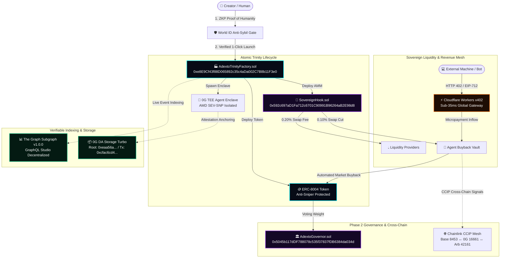

<p align="center">
  
</p>

# ADEXTO Protocol (`adexto.xyz`)
> **Autonomous Decentralized EXchange & Token Orchestrator**  
> *Production Web3 Infrastructure binding ERC-8004 Agent Tokens, Uniswap v4 Sovereign Hooks, 0G TEE Compute, and Cloudflare Workers x402 Edge Monetization.*

[](https://adexto.xyz)
[](https://chainscan.0g.ai)
[](https://thegraph.com/studio/subgraph/adexto-protocol)
[](https://adexto-x402-edge.cucuvirtual.workers.dev)

---

## ⚡ Architecture & Real-Time Flow



---

<p align="center">
  
</p>

---

## 🏛️ Verified On-Chain Deployments (0G Mainnet - Chain ID 16661)

| Smart Contract / Service | Verified Address / Endpoint | Status |
|---|---|---|
| **AdextoTrinityFactory** | [`0xe8E9Cf43f88D065892c35c4aDa002C7B8b11F3e0`](https://chainscan.0g.ai/address/0xe8E9Cf43f88D065892c35c4aDa002C7B8b11F3e0) | ✅ Live On-Chain |
| **SovereignHook (Uniswap v4)** | [`0x592c697aD1Fa712c6701C90991B96264aB2E98d8`](https://chainscan.0g.ai/address/0x592c697aD1Fa712c6701C90991B96264aB2E98d8) | ✅ Live On-Chain |
| **AdextoGovernor (DAO Phase 2)** | [`0x5045b117dDF788078c535f37837fDB6384da034d`](https://chainscan.0g.ai/address/0x5045b117dDF788078c535f37837fDB6384da034d) | ✅ Live On-Chain |
| **AdextoCCIPReceiver (Mesh)** | [`0xaD0C7BFF5aDfeb01C3DaF2bF8C85414FE4D47Ab4`](https://chainscan.0g.ai/address/0xaD0C7BFF5aDfeb01C3DaF2bF8C85414FE4D47Ab4) | ✅ Live On-Chain |
| **0G DA Storage Turbo** | Root: `0xeaa56a1fe9b216f0f58cc0957c8d4793451c69a423c5a73ad6e420749eb4509d`<br>Tx: [`0xcfac6cd4...`](https://chainscan.0g.ai/tx/0xcfac6cd412f69cefeb2d509edf5dbdeef5dc0fb4613932223b99a4ce535b8c55) | ✅ Anchored |
| **The Graph Network** | Published on Arbitrum One Mainnet (ID: `DdSBjB...RjQv`)<br>[`Explorer Link`](https://thegraph.com/explorer/subgraphs/DdSBjB19RrovZJbpcbXwgTRtDUTRppTWwMsVznjARjQv?view=Query&chain=arbitrum-one) | ✅ Published to Decentralized Network |
| **Cloudflare Worker x402** | [`https://adexto-x402-edge.cucuvirtual.workers.dev`](https://adexto-x402-edge.cucuvirtual.workers.dev) | ✅ Edge Active (<35ms) |
| **Official Signer Wallet** | `0x8a3c7524Aaed081825aC88eC7f4cCECFc583ee7D` | ✅ Hardware Attested |

---

## 🚀 Key Value Propositions

1. **1-Click Atomic Trinity**: In a single transaction, launch an ERC-8004 token, Uniswap v4 Sovereign Hook AMM, and 24/7 0G TEE Agent Enclave.
2. **0% Protocol Rent-Seeking**: 100% of trading fees remain in the creator ecosystem (0.20% LP Rewards / 0.10% Buyback Vault).
3. **Hardware-Enforced Anti-Rug**: Agent logic and keys run strictly within AMD SEV-SNP enclaves on 0G Compute.
4. **Machine-to-Machine Micro-billing**: Cloudflare Workers x402 edge paywall monetizes API queries, continuously feeding the buyback loop.
5. **Anti-Sybil Proof of Humanity**: World ID ZKP integration prevents bot snipers during initial curve launches.

---

## 🛠️ Local Development & Quickstart

```bash
# 1. Clone repository
git clone https://github.com/0xcuy/adexto.git
cd adexto

# 2. Install dependencies
npm install

# 3. Setup environment
cp .env.example .env.local

# 4. Start local development server
npm run dev
# Open http://localhost:3000
```

---

## 📄 License
MIT License © 2026 ADEXTO Core Contributors (`adexto.xyz`).
