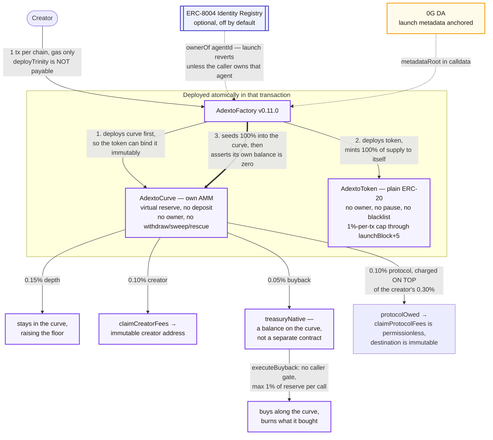

# ADEXTO Protocol (`adexto.xyz`)

> **Open a market, not just a token.**
> One transaction opens a bonding-curve market and it starts trading — with a full terminal, an agent that answers for it, and a price any machine can pay from another chain. Gas only, no liquidity deposit, on 0G, Base, Arbitrum or Monad.

[](https://adexto.xyz)
[](contracts/)
[](https://adexto.xyz/explorer)
[](https://adexto.xyz/mcp)
[](#erc-8004-agent-identity)
[](#-mainnet-deployments)
[](https://adexto.xyz/x402)

---

## What this is

Most launchpads hand a creator a token and a page. This opens a **working venue** in one transaction, and four things arrive with it — none of them a roadmap item, none needing a listing or an application:

| What arrives | What it means |
|---|---|
| **A trading terminal** | Candles from one second to one year, RSI, MACD, Bollinger, VWAP, a live order book and a running trade feed — usable on a market that is minutes old. |
| **An agent for the market** | Answers questions about its own curve, fee split and depth. It carries its token and curve addresses because it is bound to them, and inference runs on the 0G Compute router. |
| **A cross-chain price** | A buyer holding only USDC on Base takes a position without bridging and without ever holding the market's gas token. Paid over plain HTTP with an EIP-3009 authorization the token contract verifies itself; settled with real funds. |
| **Machine buyers** | An MCP server exposes the markets to AI agents — discover, quote, buy, read history — resolved from the same registry the site uses, so a new market answers on the first request. |

What is **not** here: no autonomous trading bot runs a market on a creator's behalf. ERC-8004 identity binding is real and verified on-chain at launch, but it is opt-in and it records an identity rather than starting a strategy.

### How the market itself works

The token opens **inside a bonding curve against a virtual reserve**. There is nothing to seed, so a launch costs gas and nothing else. 100% of supply enters the curve, so the creator holds no allocation to sell. Income arrives instead as 0.10% of every swap, and that 0.10% comes out of the 0.30% the creator already set — paying the creator does not make the trade more expensive. The protocol's own 0.10% is the one leg that is added on top, which is why a trader pays 0.40%. Full breakdown in [Fee split](#fee-split).

The curve is the permanent venue. There is **no graduation step** and no migration into an external pool, which is where most launchpad exploits have historically happened. There is also no withdrawal function anywhere in the curve, so no one — including us — can drain a market.

That is a statement about the protocol, not a restriction on the token. `AdextoToken` enforces a 1%-of-supply per-transaction cap only while `block.number <= launchBlock + 5`; after that `_update` adds no condition at all, and there is no blacklist, no pause, no `Ownable` and no permanent transfer hook. It is a plain ERC-20. So **anyone can list one of these tokens on any external AMM without our permission, and we could not stop it** — a second market with its own price can exist alongside the curve. The guarantee is narrower than "one market": *we* never migrate, and nobody can withdraw the curve's reserves.

### Fee split

The creator configures a total — 0.30% on the default preset — which the curve divides three ways on-chain. The protocol's own share is charged **on top of** that total rather than carved out of it, so a trader on the default preset pays **0.40%** and the creator still keeps the full 0.10%.

| Share | Bps | Comes from | Goes to |
|---|---|---|---|
| Depth | 0.15% | inside the creator's 0.30% | stays in the curve, raising the price floor as volume accumulates |
| Creator | 0.10% | inside the creator's 0.30% | streamed to the creator's wallet on every swap |
| Buyback | 0.05% | inside the creator's 0.30% | accrues on the curve as `treasuryNative`; a buyback call spends it on the curve and burns what it bought |
| Protocol | 0.10% | **added on top** | `protocolOwed`, claimable only to the factory's immutable `protocolTreasury` |
| **Trader pays** | **0.40%** | | |

Read `totalFeeBps()` on the curve instead of adding these up. It is the contract's own answer to what a trade costs.

The protocol leg is a `public constant PROTOCOL_FEE_BPS` on the factory and an `immutable protocolFeeBps` on each curve, with **no setter in either**. A setter would make the contracts owned, which is the opposite of what `/security` claims about them. So: **markets created by the previous factory can never pay it.** Their rates are immutable too. That is permanent, not a migration waiting to happen.

`claimProtocolFees()` is permissionless — anyone may call it, and the native always lands at the immutable treasury. No key is needed to collect the fee. The treasury's key is only needed by its owner, later, to move the money elsewhere.

The studio's three presets (0.10% / 0.30% / 0.50%) are UI only. The contract accepts any split subject to `swapFeeBps + PROTOCOL_FEE_BPS <= 500`; the protocol leg is inside that comparison because the 5% cap applies to what a trader pays. Depth is the residual, not an input: the factory computes `swapFeeBps − creatorShareBps − treasuryShareBps`, and the curve re-checks the sum against its own ceiling.

The buyback is permissionless and self-contained. `executeBuyback` carries only `nonReentrant` and `live` — no caller gate — so **anyone** can trigger it, capped at 1% of the native reserve per call. The native never leaves the contract: the call moves `treasuryNative` into the curve reserve and burns whatever that purchase bought, so supply falls without paying anyone. That is deliberate — a burn path that depended on us being willing to run it would be a promise rather than a mechanism.

---

## ⚙️ What one launch creates



Three things in that picture exist but are **not** part of `deployTrinity`:

- **`agentIdentity` is just an address.** It is required non-zero and stored immutably on both the token and the curve, and it may call `executeTreasuryBuyback` to burn tokens it holds itself. It is not automatically the 0G Compute agent — the studio passes the creator's own wallet by default.
- **The x402 edge is a customer of the curve, not an operator of it.** It calls `buy` with the payer as recipient, exactly like any other address, and it holds no privileged position: it cannot deposit into `treasuryNative`, which fills only from the buyback leg of swap fees. The 0G Compute agent is an inference route and holds no key to anything on-chain. See [agent-to-agent](#agent-to-agent-where-the-loop-closes-and-where-it-breaks).
- **The buyback burns, but nobody is in charge of it.** `executeBuyback` carries only `nonReentrant` and `live` — no caller gate — so anyone may trigger it, bounded to 1% of the reserve per call.

---

## 🏛️ Mainnet deployments

Every address below was confirmed to hold bytecode by a direct `eth_getCode` call against the chain's RPC. Testnet deployments are deliberately not listed here — they belong in the operator runbook, not in the public README.

`AdextoFactory` `0.11.0` is the current, executable generation: it deploys the token and its curve in one transaction, needs no liquidity deposit, can bind an ERC-8004 agent identity, and charges a 0.10% protocol fee on top of whatever the creator configures. Its runtime bytecode is **byte-identical across all four chains (21,281 bytes, keccak `0xcbb89e32ae973400723287f16f32e87f039efcef1c1f814c5805bd1a6fe3add8`)** and reproducible from source with `node scripts/compile-contracts.mjs --via-ir`.

Byte-identical is not automatic here. `protocolTreasury` is `immutable`, and Solidity puts immutables **inside** the runtime bytecode, so the hashes match only because the same treasury was used on every chain. One chain with a different treasury and the claim is false.

`0.10.0` and `0.9.0` are listed alongside it because they are **still deployed and still permissionless** — superseding a factory in the UI does not remove it from the chain, and the markets it already created keep trading. The three generations have different `deployTrinity` behaviour and, for `0.9.0`, a different selector, so they must not be confused. Each row below states its `VERSION` as read from the contract.

Markets created by `0.10.0` pay **no protocol fee and never will**, because every fee rate in `SovereignCurve` is `immutable`. That is a permanent property of those markets, not a migration that has not happened yet.

### 0G Mainnet · chain ID 16661

| Contract | Address | Notes |
|---|---|---|
| **AdextoFactory** | [`0x51c4168226463F7e5A141e1c6D30520734BC840a`](https://chainscan.0g.ai/address/0x51c4168226463F7e5A141e1c6D30520734BC840a) | **current** · `VERSION` `0.11.0` · 21,281 B · block 43704079 · `PROTOCOL_FEE_BPS` 10 |
| AdextoCurveFactory | [`0xaA85bc0cceB35B524b6BB730612540Fb88df0f8e`](https://chainscan.0g.ai/address/0xaA85bc0cceB35B524b6BB730612540Fb88df0f8e) | superseded · `VERSION` `0.10.0` · 20,054 B · block 43173642 · still live · its markets pay no protocol fee, permanently |
| AdextoCurveFactory | [`0x090a586Abfaad1eee258Fc15e8E4584B5c3B67d5`](https://chainscan.0g.ai/address/0x090a586Abfaad1eee258Fc15e8E4584B5c3B67d5) | superseded · `VERSION` `0.9.0` · 18,460 B · block 43164332 · still live |
| AdextoGovernor | [`0x5045b117dDF788078c535f37837fDB6384da034d`](https://chainscan.0g.ai/address/0x5045b117dDF788078c535f37837fDB6384da034d) | **not operational** · `governanceToken` points at the v1 hook, which has no `balanceOf` |
| ERC-8004 agent (ours) | [`3545431`](https://chainscan.0g.ai/address/0x8004A169FB4a3325136EB29fA0ceB6D2e539a432) | registered, owned by the deployer · id is chain-specific |
| AdextoTrinityFactory | [`0xe8E9Cf43f88D065892c35c4aDa002C7B8b11F3e0`](https://chainscan.0g.ai/address/0xe8E9Cf43f88D065892c35c4aDa002C7B8b11F3e0) | superseded v1 |
| SovereignHook | [`0x592c697aD1Fa712c6701C90991B96264aB2E98d8`](https://chainscan.0g.ai/address/0x592c697aD1Fa712c6701C90991B96264aB2E98d8) | superseded v1, cannot settle trades |

### Base Mainnet · chain ID 8453

| Contract | Address | Notes |
|---|---|---|
| **AdextoFactory** | [`0x216E7880D64D94335B583c539802d3e61958d4A2`](https://basescan.org/address/0x216E7880D64D94335B583c539802d3e61958d4A2) | **current** · `VERSION` `0.11.0` · 21,281 B · block 50971523 · `PROTOCOL_FEE_BPS` 10 |
| AdextoCurveFactory | [`0x2674654D4a8B79f84c1daC4Cf254EA066e59bC56`](https://basescan.org/address/0x2674654D4a8B79f84c1daC4Cf254EA066e59bC56) | superseded · `VERSION` `0.10.0` · 20,054 B · block 50712524 · still live · created no markets |
| AdextoCurveFactory | [`0xbC72FE919F85E679e7d95e2b471AaDA3c7c3Ac39`](https://basescan.org/address/0xbC72FE919F85E679e7d95e2b471AaDA3c7c3Ac39) | superseded · `VERSION` `0.9.0` · 18,460 B · block 50708028 · still live |
| AdextoGovernor | [`0x01b250a2db25561dB185f4628B93C72048D8bc1B`](https://basescan.org/address/0x01b250a2db25561dB185f4628B93C72048D8bc1B) | **not operational** · `governanceToken` is the zero address |
| ERC-8004 agent (ours) | [`84622`](https://basescan.org/address/0x8004A169FB4a3325136EB29fA0ceB6D2e539a432) | registered, owned by the deployer · id is chain-specific |
| AdextoTrinityFactory | [`0x8e63e117E71A80Cfc10fDF375F079e2e29cd7D7D`](https://basescan.org/address/0x8e63e117E71A80Cfc10fDF375F079e2e29cd7D7D) | superseded v1 |
| SovereignHook | [`0xb264D861264B0e4f8fb98A61B7694BA8a3B6BBe3`](https://basescan.org/address/0xb264D861264B0e4f8fb98A61B7694BA8a3B6BBe3) | superseded v1, cannot settle trades |

### Arbitrum One · chain ID 42161

| Contract | Address | Notes |
|---|---|---|
| **AdextoFactory** | [`0xE17f1027FC5f294327D701829baeD9d6519e922C`](https://arbiscan.io/address/0xE17f1027FC5f294327D701829baeD9d6519e922C) | **current** · `VERSION` `0.11.0` · 21,281 B · block 502476317 · `PROTOCOL_FEE_BPS` 10 |
| AdextoCurveFactory | [`0x8F3948902c48489fc9E7287590E7eb8A8E915A64`](https://arbiscan.io/address/0x8F3948902c48489fc9E7287590E7eb8A8E915A64) | superseded · `VERSION` `0.10.0` · 20,054 B · block 500429767 · still live · created no markets |
| AdextoCurveFactory | [`0x795D11BEAc025771e9e96Bb4489068b1eDC4b47a`](https://arbiscan.io/address/0x795D11BEAc025771e9e96Bb4489068b1eDC4b47a) | superseded · `VERSION` `0.9.0` · 18,460 B · block 500393825 · still live |
| AdextoGovernor | [`0x33811F9c53da5071A130F18D844f64999dBD43bA`](https://arbiscan.io/address/0x33811F9c53da5071A130F18D844f64999dBD43bA) | **not operational** · `governanceToken` points at the v1 hook, which has no `balanceOf` |
| ERC-8004 agent (ours) | [`1457`](https://arbiscan.io/address/0x8004A169FB4a3325136EB29fA0ceB6D2e539a432) | registered, owned by the deployer · id is chain-specific |
| AdextoTrinityFactory | [`0x2674654D4a8B79f84c1daC4Cf254EA066e59bC56`](https://arbiscan.io/address/0x2674654D4a8B79f84c1daC4Cf254EA066e59bC56) | superseded v1 |
| SovereignHook | [`0xbC72FE919F85E679e7d95e2b471AaDA3c7c3Ac39`](https://arbiscan.io/address/0xbC72FE919F85E679e7d95e2b471AaDA3c7c3Ac39) | superseded v1, cannot settle trades |

### Monad Mainnet · chain ID 143

| Contract | Address | Notes |
|---|---|---|
| **AdextoFactory** | [`0x5800e9715a47a598fce9bc3B65a95FD6BeBf76A3`](https://monadscan.com/address/0x5800e9715a47a598fce9bc3B65a95FD6BeBf76A3) | **current** · `VERSION` `0.11.0` · 21,281 B · block 102583076 · `PROTOCOL_FEE_BPS` 10 |
| AdextoCurveFactory | [`0xbC72FE919F85E679e7d95e2b471AaDA3c7c3Ac39`](https://monadscan.com/address/0xbC72FE919F85E679e7d95e2b471AaDA3c7c3Ac39) | superseded · `VERSION` `0.10.0` · 20,054 B · block 100872196 · still live · created no markets |
| AdextoCurveFactory | [`0x05EFA7F066FcbefbE650EDd58583C107831A600B`](https://monadscan.com/address/0x05EFA7F066FcbefbE650EDd58583C107831A600B) | superseded · `VERSION` `0.9.0` · 18,460 B · block 100842422 · still live |
| AdextoGovernor | [`0x01b250a2db25561dB185f4628B93C72048D8bc1B`](https://monadscan.com/address/0x01b250a2db25561dB185f4628B93C72048D8bc1B) | **not operational** · `governanceToken` is the zero address |
| ERC-8004 agent (ours) | [`10247` and `10251`](https://monadscan.com/address/0x8004A169FB4a3325136EB29fA0ceB6D2e539a432) | both registered and both owned by the deployer · `10251` is the id the live Monad markets bind · ids are chain-specific |
| AdextoTrinityFactory | [`0x8e63e117E71A80Cfc10fDF375F079e2e29cd7D7D`](https://monadscan.com/address/0x8e63e117E71A80Cfc10fDF375F079e2e29cd7D7D) | superseded v1 |
| SovereignHook | [`0xb264D861264B0e4f8fb98A61B7694BA8a3B6BBe3`](https://monadscan.com/address/0xb264D861264B0e4f8fb98A61B7694BA8a3B6BBe3) | superseded v1, cannot settle trades |

> Some addresses repeat across chains, and one repeats three times. That is expected, not a copy-paste error: `CREATE` derives an address from the deployer and its nonce, so the same deployer at the same nonce lands on the same address on every EVM chain. `0xbC72FE919F85E679e7d95e2b471AaDA3c7c3Ac39` is the **superseded 0.9.0 factory on Base**, the **superseded 0.10.0 factory on Monad**, and the **v1 hook on Arbitrum** — three different contracts at one address on three different chains, each confirmed by reading `VERSION` and the bytecode size from that chain. Always check the chain before trusting an address here.
>
> The `0.11.0` addresses do **not** repeat, and that is the same fact seen from the other side: by the time they were deployed the deployer's nonce differed per chain, so `CREATE` landed somewhere different on each.

**Deployer:** `0x8a3c7524Aaed081825aC88eC7f4cCECFc583ee7D`

**Protocol treasury:** [`0x24268Fffc119ec5550F68e80D94476fD64daE967`](https://chainscan.0g.ai/address/0x24268Fffc119ec5550F68e80D94476fD64daE967) — the immutable destination of the 0.10% protocol leg on every `0.11.0` curve. Deliberately not the deployer: that key is online and is already the `creator` of live markets, which would make protocol revenue and creator revenue indistinguishable on-chain. It was a fresh address with no code, nonce 0 and no balance on all four mainnets when it was chosen.

---

## 📋 Honest status

| Component | Works? | Exactly what that means |
|---|---|---|
| `AdextoFactory` `0.11.0` on 4 mainnets | **Live** | Broadcast and read back on each chain: `VERSION` `0.11.0`, `PROTOCOL_FEE_BPS` 10, `protocolTreasury` equal to the address published above, `totalProjectsCount` 0 at deployment, and runtime bytecode byte-identical across all four (21,281 B). |
| Protocol fee revenue | **Live and collecting on all four chains** | The leg is charged and accrues on every `0.11.0` curve. Read from chain today: `0.000047209005338664 0G` has been claimed through to the treasury, and a further `0.000770149061102985 0G` sits accrued on the three 0G curves waiting for a permissionless claim — plus `0.008936947973117330 MON` on Monad, `0.0000000803 ETH` on Base and `0.0000002001 ETH` on Arbitrum. The treasury's nonce is `0` on all four chains, so nothing has ever been spent out of it. The destination is `immutable` on each curve, so it cannot be redirected and there is no setter to try. |
| `AdextoCurveFactory` `0.10.0` on 4 mainnets | **Live, superseded** | Still deployed and still permissionless. Superseded because `0.11.0` adds the protocol fee leg. The markets it created on 0G keep trading on their original three-way split and can never pay a protocol fee, since their rates are immutable. |
| `AdextoCurveFactory` `0.9.0` on 4 mainnets | **Live, superseded** | Still deployed and still permissionless. Superseded because `0.10.0` added the ERC-8004 binding, which changed the `deployTrinity` selector. All three generations are listed in the tables above so nobody mistakes one for another. |
| ERC-8004 agent binding | **Works. Off unless you ask for it — and one live market lost it** | Pass an agent id at launch and the factory calls `ownerOf(agentId)`, reverting unless you own that agent. Leave it out and the launch is one transaction with no agent. Exercised on mainnet by `$PARCEL` and `$CURB` on Monad (`agentId 10251`) and by the **first** `$ADEXTO` market on 0G (`agentId 3545431`); the live `$ADEXTO` reads `agentBound false` because the relaunch onto `0.11.0` dropped the binding and `agentBound` is `immutable` — the full account is in [ERC-8004 agent identity](#erc-8004-agent-identity). What is NOT used: the Reputation and Validation registries, and `supportsInterface`. So this integrates with one of the standard's three registries — it is not ERC-8004 compliance and this file does not call it that. |
| Launching through the site | **Enabled** | All four `NEXT_PUBLIC_CURVE_FACTORY_*` are set to the `0.11.0` addresses above, so the studio launches on the current generation. `NEXT_PUBLIC_CURVE_FACTORY_PREV_*` carries the `0.10.0` addresses for verification only and is deliberately excluded from every "can this chain launch" check. |
| Live markets | **6, across all four mainnets** | `$ADEXTO`, `$ADT` and `$ZEEBO` on 0G, `$PARCEL` on Monad, `$BLOOP` on Base, `$WOMBO` on Arbitrum One. `totalProjectsCount` on the `0.11.0` factories reads `3 · 1 · 1 · 2` for 0G, Base, Arbitrum and Monad — seven launches, six of them listed, because `$CURB` on Monad was delisted after `$PARCEL` replaced it and nothing can remove it from the chain. Every launch that exists on chain is recorded once in [`src/config/onchain-launches.json`](src/config/onchain-launches.json) with its status — live, superseded, or a throwaway test ticker from a demo recording — and `audit_consistency.mjs` fails the build if an on-chain launch appears that the file does not account for. `allProjects` is append-only with no delete, so the factories' raw counter can only rise; it is not a growth number and is not quoted as one. |
| Trading / swap | **Live on all four mainnets** | Real fills exist on every chain. Read from the curves today: `$ADEXTO` `swapCount 21`, `$PARCEL` `12`, `$ZEEBO` `6`, `$WOMBO` `5`, `$BLOOP` `2`, `$ADT` `1`, and the delisted `$CURB` still at `5` — 47 fills across the listed markets, 52 counting `$CURB`. The `$PARCEL` session was `buy · buy · sell · buy · buy`, a shape a market makes rather than a demo that only ever buys. The sell leg matters most: it goes `approve` then `sell` against the curve, which is the exit path a bonding curve is usually accused of not having. |
| MCP server for AI agents | **Live, 7 tools** | `https://adexto.xyz/api/mcp` answers `tools/list` with `list_markets`, `get_market`, `quote_buy`, `how_to_pay`, `buy_token`, `pay_and_buy` and `trade_history`, resolved from the same registry the site reads, so a market launched a minute ago answers on the first request. `pay_and_buy` is the one that finishes a purchase, and it is honest about how: **the signature is made by the operator's key on this server, not by a wallet the model controls.** It is gated on an `x-agent-key` header, capped at `0.20 USDC`, and every term — recipient, asset, amount — is taken from the gateway's own challenge rather than from the model, so a fully prompt-injected agent can at most buy one of our own markets and send the money to our own treasury. |
| Own AMM (`AdextoCurve`) | **Deployed per launch** | The curve ships with the factory. `SovereignCurve` is the previous generation's curve and still serves the markets it was deployed for. |
| Agent compute (0G) | **Works** | Inference runs through the 0G Compute Router. The router reports each model as Intel TDX attested via dstack and we print exactly what it reports — that label is the router's word, attributed to it, because we do not fetch or verify the raw quote ourselves. |
| x402 edge gateway | **Settles on Base, delivers on all four mainnets** | Quote, payment and delivery all run, and every one of the four target chains has been paid for with real funds — `DELIVERY_RPC` in the worker maps a market's `chainId` to its own endpoint, so the destination is read from the market rather than hard-coded. USDC is taken on Base through an EIP-3009 authorization and the curve on the target chain sends the tokens to the payer's own address. Delivery runs before the charge, so a failed fill costs us and never the buyer. Fills read back from chain, all `status 1`, all submitted by the relayer `0xDe1f…C627`: `$PARCEL` on Monad as the 6th and 7th swaps on its curve, `$WOMBO` on Arbitrum at block `505674141`, `$BLOOP` at block `51375604`, and `$ZEEBO` on 0G at block `44560323` settled on Base at `51419336`. `$BLOOP` is the one to read carefully — its market lives on Base, so payment and delivery land on the same chain; it proves the delivery router, not a bridge. An x402 delivery is an ordinary `buy`, which is why it pays the same fee legs and grows the buyback vault without anything routing revenue anywhere. See [x402 edge](#x402-edge). |
| 0G DA metadata anchoring | **Live** | Launch metadata is anchored and its storage root travels in calldata as `metadataRoot`. |
| The Graph indexing | **Deployed on Base and Arbitrum, and currently indexing nothing — a bug, not a coverage gap** | `adexto-base` and `adexto-arbitrum` are live, synced and report `hasIndexingErrors: false`. They also return zero projects and zero curves, and that used to be correct because neither chain had a market. It is no longer correct: `$BLOOP` and `$WOMBO` are live on those chains and the subgraphs are synced well past both launch blocks. The cause is in the published build — `networks.json` carried `AdextoFactory` as the **zero address** on every network, so the `0.11.0` data source was pointed at nothing while only the superseded `0.10.0` data source was wired up, and `0.10.0` created no markets on Base or Arbitrum. Regenerating the file from `build/deployments.json` fills the real addresses in; republishing the subgraph to Studio has not been done yet, so the endpoints stay empty until it is. Nothing on the site depends on them: 0G and Monad were never served by The Graph at all, 0G is read straight from RPC logs and Monad is covered by Envio, see the row below. Not published to the decentralized network. Detail in [The Graph](#the-graph). |
| 0G trade history straight from RPC | **Live, with a measured reach** | `evmrpc.0g.ai` now refuses any `eth_getLogs` span over **100,000 blocks**, down from the 2,000,000 that used to pass, so `LOG_SPAN_BY_CHAIN[16661]` is `90,000` and the 16-call budget reaches 1,440,000 blocks back. That covers `$ADEXTO`, the oldest listed 0G market, at 1,187,794 blocks. It is worth stating because the failure mode is silent: an over-wide range comes back as a rejection the UI cannot distinguish from "no trades yet", which is why `audit_consistency.mjs` probes the configured span against the live RPC on every run rather than trusting the constant. A separate 20,000-result cap also exists and does not bite here, because every query is filtered to one curve address. |
| Envio indexing (Monad) | **Live, full history** | [`envio/`](envio/) indexes `AdextoFactory` `0.11.0` and every curve it deploys on chain 143. HyperSync covers all 1.93M blocks since the factory was deployed in under 45 seconds; the same range over `rpc.monad.xyz` takes about six hours, because Monad caps `eth_getLogs` at 100 blocks and 1.93M ÷ 100 is ~19,200 sequential calls. Built as its own indexer rather than one more network on the subgraph because `graphprotocol/networks-registry` lists `monad` **without** Subgraphs support — Firehose and Substreams only — so Studio will not accept it however the manifest is written. Verified against contract storage rather than against itself: 22 figures per market including the live fee ledger. Requires a free `ENVIO_API_TOKEN`. [Details](envio/README.md). |
| No admin surface | **Guaranteed by the contracts** | Every fee rate is `immutable`, nothing on the launch path has an owner or a setter, and there is no withdrawal function in the curve. So no rate can be redirected, no market can be drained, and no upgrade can change the terms a trader agreed to. This is the protocol's central guarantee, and it is checkable in `contracts/` rather than promised. |

### Why a bonding curve rather than a liquidity pool

The reason is the launch model, and it is checkable in the contracts rather than a matter of taste.

| | this curve | a standard liquidity pool |
|---|---|---|
| Capital to open a market | none — the native side starts entirely virtual, and `deployTrinity` is not `payable`, so it cannot accept a deposit | real liquidity must be deposited by someone |
| Creator's token position | none — the whole supply is minted to the factory and loaded into the curve in the same transaction, and the factory then requires its own balance to be zero before the launch can succeed | the creator must hold tokens to pair with liquidity |
| Can reserves be pulled out | no — there is no `withdraw`, `rescue`, `sweep`, `drain` or `emergency` function anywhere, no owner and no `onlyOwner`; native leaves through exactly two paths, a seller's payout and the creator's fee claim to an immutable address | yes, and correctly so: a provider may withdraw at any time |
| Migration step | none — the curve is the permanent venue | the usual launchpad pattern graduates a curve into a pool, and that step is where much of the historical exploit surface lives |
| Creator fee | 0.10% of every swap accrues on-chain inside the 0.30% the creator configures, so paying the creator costs the trader nothing extra | fees accrue to liquidity providers; paying a creator needs custom hook support the venue may not offer |
| Code paths across our four chains | one, byte-identical | whatever venue happens to exist per chain |

Row three carries the weight. A liquidity provider being able to withdraw is not a flaw — it is what an AMM is for — but it means the venue can be pulled out from under holders, and "we won't" is only a promise. Here the guarantee is the absence of code that could do it.

### ERC-8004 agent identity

**It works, and it is off unless you ask for it.** Pass an agent id at launch and `AdextoFactory` calls `ownerOf(agentId)` on the [ERC-8004](https://eips.ethereum.org/EIPS/eip-8004) Identity Registry, refusing the launch unless you own that agent — so a token cannot attach itself to somebody else's identity and inherit its reputation. Leave the id out and the launch is one transaction with no agent attached.

**Scope, stated precisely: this integrates the Identity Registry.** The standard has three registries, and ownership is the one that matters at launch — the factory calls `ownerOf(agentId)` and reverts unless the caller owns that agent. Reputation and Validation are outside what a launch needs, so they are not touched, and `supportsInterface` is not implemented. Calling this "ERC-8004 compliance" would overstate one registry into three.

| | |
|---|---|
| Identity Registry | `0x8004A169FB4a3325136EB29fA0ceB6D2e539a432` — same address on all four mainnets, verified answering `ownerOf` |
| Our own agent | **registered on all four mainnets** — Base `84622`, Arbitrum One `1457`, 0G `3545431`, Monad `10247` and `10251`, every one of them confirmed by `ownerOf` as owned by the deployer. Monad has two because a second was registered during the Monad work; `10251` is the id the live markets there actually bind |
| Exercised at launch | **on 0G and Monad.** `$PARCEL` and the delisted `$CURB` read `agentBound true, agentId 10251`. The first `$ADEXTO` market read `agentBound true, agentId 3545431` too — and **the live one does not, because a relaunch dropped it.** See below |
| Regression, stated because it is permanent | **the live `$ADEXTO` market lost its binding.** The `0.10.0` market at `0x0860a80f…37C6` is bound to `3545431`. Relaunching onto `0.11.0` to gain the protocol fee leg sent `bindAgent: false`, hard-coded in `scripts/relaunch-market.mjs` while that same script was carefully preserving every fee rate. `agentBound` is `immutable`, so `0xA1358C17…1DF7` can never be bound; only another relaunch would fix it. The script now reads the old token's binding and carries it forward, refuses to proceed if the agent is no longer ours, and asserts `agentBound` on the newly born token before touching the registry |
| Registry on testnets | **absent**, so the agent path can only be exercised on mainnet or a local devchain |
| Status of the standard | EIP-8004 is a **Draft**, so what we integrate against can still change. This is about the EIP, not about our code |
| Who controls the registry | **not us.** It is an upgradeable proxy owned by a third party, so its behaviour can change without our involvement or consent |
| Reputation / Validation registries | **not used** |
| Read on a token | `agentBound()`, then `agentId()` and `agentRegistry()` |

Five things that will bite you otherwise, and the first one already bit us.

**A relaunch drops the binding unless something carries it.** The first `$ADEXTO` market, created by the `0.10.0` factory at [`0x0860a80f…37C6`](https://chainscan.0g.ai/address/0x0860a80f6fF87423c3cC379199700576857437C6), reads `agentBound true`, `agentId 3545431`, `agentRegistry 0x8004A169…a432`. It was relaunched onto `0.11.0` so the market would pay the protocol fee leg, and the live market at [`0xA1358C17…1DF7`](https://chainscan.0g.ai/address/0xA1358C17004469C7CA5365AbafD294F9b2c11DF7) reads `agentBound false`, `agentId 0`, registry at the zero address.

Nothing failed. `scripts/relaunch-market.mjs` sent `bindAgent: false` and `agentId: 0` as literals, in the same file that goes to deliberate trouble to preserve every fee rate so that "the only difference is the protocol leg". The transaction succeeded, every post-launch check passed, and no line ever read `agentBound()` on the token it had just created. Because `agentBound` is `immutable`, the live market can never be bound — only another relaunch would restore it, and that would abandon 21 swaps of history.

The script now reads `agentBound()`, `agentId()` and `agentRegistry()` off the old token, checks `ownerOf(agentId)` still returns the deployer and **stops** rather than proceeding unbound, passes the id through to `deployTrinity`, and then reads the binding back off the newly created token before the registry is touched. A correct argument and a correct result are two different things, and this bug lived in the gap between them.

**An agent id means nothing without its chain.** The registry sits at one address on all four mainnets, which invites the assumption that an id is global. It is not — each registry keeps its own state, and `ownerOf(0)` returns three *different* owners across the four chains. Our own registrations came back `84622` on Base, `1457` on Arbitrum, `3545431` on 0G and `10247` on Monad for the same agent — plus `10251`, a second Monad registration, which is the one the live Monad markets bind. Launching four chains with one id binds on the chain it came from and reverts on the rest with `Factory: agent not owned by caller`, after gas has been spent on each. Register once per chain and pass that chain's id.

**Binding is a separate step from launching.** ERC-8004 wants the registration file to contain its own `agentId`, and the id does not exist until `register()` returns — so a file pinned beforehand cannot contain it. The creator registers first and passes the id to the launch. Leaving the identity off keeps the launch at one transaction, which is why the gas-only property is unaffected.

**`agentBound()` is the flag to read, not `agentId()`.** Agent id 0 is a real agent with a real owner on 0G, Base, Arbitrum One and Monad, so zero cannot mean "no agent". An earlier revision of this used `agentId == 0` as that sentinel; testing against the live registries caught it before it was frozen into immutable bytecode.

**The registration file is `data:` until IPFS pinning is configured.** ERC-8004 permits a base64 `data:` URI for fully on-chain metadata, and that is the default here because an `ipfs://` CID that nobody pins is a dead link recorded permanently. Set `PINATA_JWT` to pin instead; the CID is recomputed locally and compared with what the service reports. This matters: an empirical study of ERC-8004 found most registrations are placeholders with no live endpoint ([arXiv 2606.26028](https://arxiv.org/html/2606.26028)), and reading agent #40 on our own four chains shows an empty string on 0G, un-encoded raw JSON on Monad, and an HTTPS URL whose embedded id does not match the token on Base.

The script reads the id out of the mint `Transfer` event rather than assuming ids are sequential, then calls `setAgentURI` with a rebuilt file that contains that id.

```bash
node scripts/register-agent-8004.mjs --chain base              # dry run, no gas
node scripts/register-agent-8004.mjs --chain base --broadcast   # registers, then sets the URI
node scripts/test-erc8004-binding.mjs                          # 24 assertions, local devchain
```

Registering on all four cost roughly $0.10 in total across eight transactions.

### Agent-to-agent: where the loop closes and where it breaks

This is the point of pairing an agent identity with a bonding curve, and **every edge of the loop carries value end to end** — verified with real funds rather than reasoned about.

A buyer, human or agent, pays without a human, an account or a card. What it buys is a **position in a market on another chain**, and that money reaches the token itself.

| Edge | State | Evidence |
|---|---|---|
| Agent has an on-chain identity | **works** | ERC-8004 binding, verified by `ownerOf(agentId)` at launch |
| An LLM can drive the whole sequence | **works, with the signer named** | Seven MCP tools at `/api/mcp`. An agent running `zerog/glm-5.3` on the 0G Compute router discovered `$ZEEBO`, quoted it, bought it and read the fill back. The authorization was signed by the **operator's key on this server**, not by the agent — see [x402 edge](#x402-edge) for why it is built that way and what the cap is |
| Buyer discovers the terms | **works** | HTTP 402 + `WWW-Authenticate: x402` + x402 v2 `accepts[]` with the asset, amount, payee and a full quote |
| Buyer proves it can pay | **works** | EIP-3009 signature recovered and matched to `from`, checked against the balance and the on-chain nonce state |
| **Buyer actually pays** | **works** | `transferWithAuthorization` on mainnet USDC. `0.10 USDC` moves from payer to treasury; a replayed authorization is refused |
| Buyer receives the token | **works** | the curve's `buy` takes a recipient, so tokens go straight to the payer's address, above the quoted `minTokensOut` |
| Earnings buy the token | **works** | a plain native transfer to the curve — empty calldata — executes a market buy |
| Agent burns what it bought | **works** | `executeTreasuryBuyback` burns from the caller's own balance, gated to `agentIdentity` and the curve |

The last two were verified on 0G mainnet rather than reasoned about. Sending `0.003 0G` to the curve with **no calldata** returned 148.317329 tokens, incremented `swapCount`, and moved the spot price — `receive()` routes into `_buy`. Then `executeTreasuryBuyback` destroyed 74.158664 of them, and `totalSupply` fell by exactly that amount. A random address calling the same function is rejected with `Unauthorized agent`.

So the whole loop is reachable today and **needs no new contract**: a buyer pays on one chain, the curve delivers on another, and native spent on the curve can be bought and burned so supply falls permanently.

Two mechanics worth knowing before building on it:

- **The burn is funded by trading, it runs without anyone deciding to, and supply has already fallen.** `treasuryNative` fills from the buyback leg of swap fees, so nothing can be deposited into it and nothing needs to be — an x402 delivery is itself a `buy`, so it pays that leg and the vault grows on every fill. After a purchase settles, the edge spends the vault through `executeBuyback` to buy and burn, gated on the vault being worth at least 3x the gas to trigger it: one call costs about `0.0005 0G` while a fill contributes `0.000257 0G`, so burning every time would destroy less than it spent. The gate reads chain state rather than waiting for a person. The first burn destroyed `7.110759702852663544 $ADEXTO` and took total supply to `999,999,918.730575824909329011` — [`0x792023ab…8ab66bc5`](https://chainscan.0g.ai/tx/0x792023abdcf0ce1af431cb717a874e0344d1e3f8b84223aeddeaff008ab66bc5). `executeBuyback` has no caller gate, so the burn does not depend on us running it, which was verified by simulating the call from a random address.
- **`agentIdentity` is set once, at launch, and is immutable.** On the live $ADEXTO token it is `0x8a3c…ee7D`. That permission is what gates the burn, so choosing the address at launch decides who can trigger it for the life of the market.

### x402 edge

**It sells one thing: a position in one of these markets, bought with USDC the payer already holds.** Pay `0.10 USDC` on Base and the curve on the market's own chain sends the tokens to your own address. No bridge, and no need to hold that chain's gas asset. All four mainnets are live targets; when the market happens to live on Base too, payment and delivery land on the same chain and nothing crosses — same code path, one less hop.

| Step | State | What actually happens |
|---|---|---|
| 1. Quote the terms | **works** | An unpaid call gets HTTP 402, a `WWW-Authenticate: x402` header, and an x402 v2 `accepts[]` block naming the asset, the exact amount, the payee and the timeout — plus a `quote` carrying the curve, the native spent, and the `minTokensOut` the buy will not go below. |
| 2. Verify the payment | **works** | The caller signs an EIP-3009 `TransferWithAuthorization` for USDC — typed data, so no gas and no allowance. The signature is recovered and matched to `from`, the EIP-712 domain is read **from the USDC contract** rather than the request, and the nonce is checked on-chain before anything else happens. |
| 3. Deliver, then collect | **works** | The curve's `buy` runs first with the payer as recipient. Only after that receipt is confirmed is the authorization submitted to USDC. Both transaction hashes come back in the body, and the settlement result repeats in `X-PAYMENT-RESPONSE`. |

The third step was the one that used to be missing, and it was closed with real money rather than declared done. One request produced a Base settlement and a 0G delivery 16.2 seconds apart; a replayed authorization is refused with `invalid_transaction_state`. Full payload reference, status codes and both transaction hashes: [adexto.xyz/x402](https://adexto.xyz/x402).

Three things that are easy to gloss over, and shouldn't be:

- **Settlement rides on USDC's own signature check, not on a scheme of ours.** EIP-3009 `TransferWithAuthorization` is verified by the token contract itself, so there is no escrow to trust and nothing custom for an integrator to learn. A caller still sending the retired `X-402-Authorization` header gets an explicit rejection naming the reason rather than a silent failure.
- **The relayer key is funded and in use, and its blast radius is deliberately small.** `X402_RELAYER_PRIVATE_KEY` is read and used to submit both legs. It belongs to a dedicated operator, **not the deployer** — the deployer key was never placed in the Worker. Because `transferWithAuthorization` is permissionless and its whole content is signed by the payer, including `to` and `value`, that key cannot move anyone's funds or redirect a payment. The worst outcome of a leak is drained gas and inventory.
- **The two legs are not atomic, and delivery capacity is finite.** Payment clears on Base while delivery happens on the target chain, with nothing on-chain binding them. The buyer carries no funds risk because no charge is taken until a delivery succeeds, but they do rely on us submitting that buy. Filling an order also means spending native inventory we hold, so the endpoint answers `503` once it runs low — before any authorization is touched.

The boundary is declared in the payload rather than in prose: every 402 carries `inventory.remainingBuys`, so an integrator learns the limit from the first reply instead of after building a payment client.

**All four mainnets are delivery targets, and none of them is hard-coded.** `DELIVERY_RPC` in the worker maps a market's `chainId` to its own endpoint, so the destination comes from whichever market the ticker resolves to. Each one has been paid for once with real funds; the transaction hashes are in the [status table](#-honest-status).

Making that work on the two ETH chains needed one number fixed, and it is worth recording because the number looked harmless. The inventory gate was `gasHeadroom = parseEther("0.05")` — 0.05 of the native token, on any chain. On 0G and Monad that is a cent or less. On Base and Arbitrum it is 0.05 ETH, roughly $120 that had to sit idle before a $0.10 fill was allowed, and the symptom was a quote reporting `remainingBuys: 7` and `inStock: false` in the same breath. It is now the chain's own gas price times 150,000 gas times 3, with a fallback of one percent of the order's native value if the gas price cannot be read — proportional to order size, so it can never be a flat $120 again.

The buyback router that would close the revenue edge above, together with the Monad-specific engineering, is tracked in a separate repository: [`0xcuy/adexto-monad`](https://github.com/0xcuy/adexto-monad). The curve, factory, registry and terminal stay here.

**An LLM can now complete a purchase, and the honest version of that claim matters.** The [MCP server](https://adexto.xyz/mcp) exposes seven tools, and `pay_and_buy` is the one that finishes a buy: the agent chooses the market and the size, and the EIP-3009 authorization is signed by the **operator's key on this server**. The agent does not hold funds. Every term — recipient, asset, amount — is read back out of the gateway's own 402 challenge and compared against hard-coded limits before anything is signed, the delivery address is never exposed because tokens always go to the signer, and the whole endpoint is gated on an `x-agent-key` header and capped at `0.20 USDC`. So the correct sentence is *the agent decided what to buy and executed the purchase*, not *the agent paid from its own funds*. This was exercised end to end against `$ZEEBO` on 0G: the buy landed at block `44560323` and settled on Base at `51419336`.

### The Graph

Deployed for Base and Arbitrum, and read by the site — `SUBGRAPH_URL_*` points at both. The manifest and per-network config are generated from `subgraph/chains.json` plus `build/deployments.json` (`npm run networks` in `subgraph/`).

| Subgraph | Version | Endpoint |
|---|---|---|
| `adexto-base` | `v0.11.1` | `https://api.studio.thegraph.com/query/1757874/adexto-base/v0.11.1` |
| `adexto-arbitrum` | `v0.11.1` | `https://api.studio.thegraph.com/query/1757874/adexto-arbitrum/v0.11.1` |

**`v0.11.0` indexed nothing on either chain, and `v0.11.1` exists to fix it.** For a long time the empty result was correct: Base and Arbitrum had factories and no markets. `$BLOOP` and `$WOMBO` ended that, and the endpoints stayed empty anyway, synced far past both launch blocks with `hasIndexingErrors: false`.

The fault was in the published build rather than in the mappings. `subgraph/networks.json` is generated, and the committed copy had `AdextoFactory` — the `0.11.0` generation — recorded as `0x0000000000000000000000000000000000000000` on every network, with the `startBlock` of the *old* factory. So the manifest that was deployed wired up only the `0.10.0` data source, and `0.10.0` created no markets on Base or Arbitrum. **A data source pointed at the zero address indexes nothing and reports itself healthy while doing it**, which is exactly why an indexer is worth checking against chain state rather than against its own status field.

`npm run networks` regenerates the file with the real addresses and start blocks, and `v0.11.1` is that build, republished to Studio. Base confirms it: one project, `BLOOP`, one curve at `curveVersion 0.11.0` with `swapCount 2` and `volumeNative 80300218841094` — the same number the curve contract stores. Arbitrum carries the same manifest and has roughly 6.9M blocks to backfill from the `0.10.0` start block, so it reports `$WOMBO` once it gets there.

Neither endpoint is load-bearing for the chains that matter: `SUBGRAPH_URL_0G` is empty and 0G trades come straight from RPC logs, and Monad is served by [Envio](envio/README.md) with full history. The Graph cannot serve either of those chains anyway — 0G is absent from its networks registry, and `monad` is listed there without Subgraphs support. The two testnet slugs, `adexto-base-sepolia` and `adexto-arbitrum-sepolia`, are named in `chains.json` but have never been created in Studio, so a deploy to them answers `Subgraph not found`. They index the `0.10.0` factories and no markets exist on either, so nothing is lost by that.

Known bug, stated because it affects numbers this subgraph publishes: `subgraph/src/shared.ts` counts sell volume as the event's `amountOut`, which is the native a seller receives **after** fees, while a buy counts `msg.value`, which is gross. So the same trade size registers as two different volumes depending on direction, and `volumeNative` on Base, Arbitrum and 0G is short by the fee slice on every sell. The Envio indexer had the identical bug and it is fixed there; correcting it here means publishing a new subgraph version across the live chains, which has not been done yet. The contract itself had this bug first — see the comment on `totalVolumeNative += leaving + depthFee` in `contracts/AdextoCurve.sol`.

`v0.11.0` indexes **both curve generations side by side**, because the two `Swap` events are not the same event: `0.11.0` inserts `protocolFee` before both reserves, giving it eleven fields and a different `topic0`. One data source cannot match both, so repointing the existing one at the new factory would have dropped every market the old factory created — and reported itself healthy while doing it. There are two data sources and two templates, with the mapping logic held once in `src/shared.ts`.

`Curve.curveVersion` exists for the same reason: without it, `protocolFeeBps: 0` on an old curve is indistinguishable from a new curve that charges nothing, which would suggest the rate can change. It cannot — it is `immutable` per curve.

Earlier versions: `v0.10.1` fixed a 1e18 unit mismatch between `openingPriceNative` and `spotPriceNative`. `v0.10.2` removed "agent buyback burns" from the manifest description, since `executeBuyback` has no caller gate and attributing it to an agent overstated the contract.

Nothing is published to the decentralized network, and publishing alone would not make it serve queries: indexers are paid in proportion to curation signal, so a subgraph with token signal gives them no reason to index it. The Studio endpoints above answer queries today without that.

Two of the four chains cannot use Subgraph Studio. That is The Graph's coverage, not our choice:

| Chain | Target | Reason |
|---|---|---|
| Base, Arbitrum One | Subgraph Studio | Subgraphs served, indexing rewards enabled — **deployed, see above** |
| 0G Mainnet | Self-hosted Graph Node | absent from `graphprotocol/networks-registry` entirely |
| Monad Mainnet | Self-hosted Graph Node | listed, but served by Firehose and Substreams only — not Subgraphs |

Self-hosting runs from `subgraph/docker-compose.yml`. Public-RPC `eth_getLogs` ceilings are probed rather than assumed and recorded per chain in `subgraph/chains.json`: 2,000 blocks on 0G, and a hard 100 on Monad, which returns `-32614` above that.

---

## 🛠️ Local development

```bash
git clone https://github.com/0xcuy/adexto.git
cd adexto
npm install
cp .env.example .env.local
npm run dev          # http://localhost:3000
```

Contracts compile reproducibly, with no Hardhat run required:

```bash
node scripts/compile-contracts.mjs --via-ir     # -> build/artifacts/
node scripts/deploy-sovereign-curve.mjs --chain base            # dry run, no gas
node scripts/deploy-sovereign-curve.mjs --chain base --broadcast # spends gas
```

The dry run checks the RPC chain ID, the deployer balance and `estimateGas` before anything is sent, and refuses to broadcast if the balance cannot cover the deployment.

### A note on reserved tickers

`RESERVED_SYMBOLS` in `src/lib/registry.ts` blocks a set of tickers from being claimed through `/api/deploy`. This is an application-level guard only: `deployTrinity` on the factory has no access control, so the reservation cannot bind anyone who calls the contract directly. `ADEXTO_OFFICIAL_DEPLOYER` grants one address an exception so the protocol can launch its own reserved tickers; it is empty by default, which means nobody can.

---

## 📄 License

MIT © 2026 ADEXTO Core Contributors · [adexto.xyz](https://adexto.xyz)
