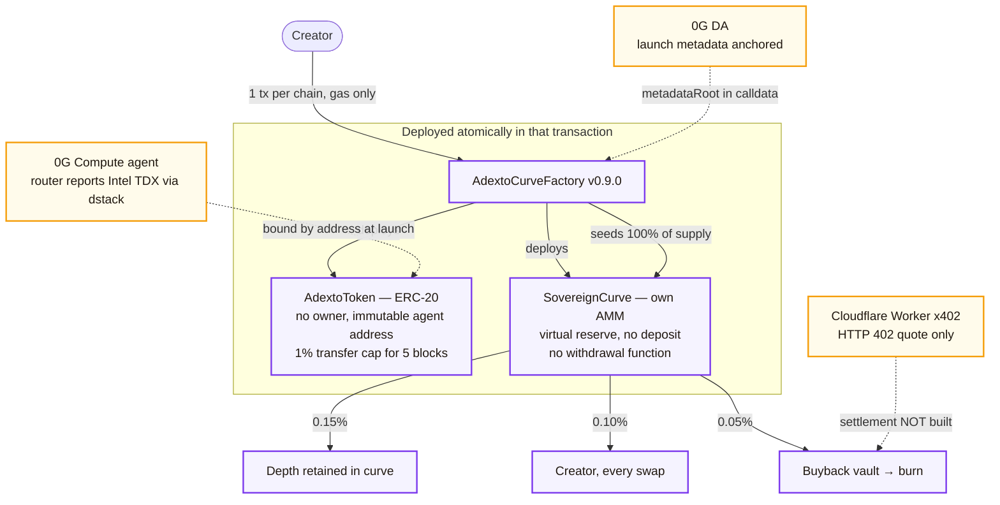

<p align="center">
  
</p>

# ADEXTO Protocol (`adexto.xyz`)

> **Autonomous Decentralized EXchange & Token Orchestrator**
> Launch an agent-bound ERC-20 on its own bonding curve with no liquidity deposit — gas only — on 0G, Base, Arbitrum or Monad.

[](https://adexto.xyz)
[](contracts/)
[](#erc-8004-agent-identity)
[](#-mainnet-deployments)
[](https://adexto-x402-edge.cucuvirtual.workers.dev/v1/x402/adexto)

---

## What this is

A creator launches a token and it opens **inside a bonding curve against a virtual reserve**. There is nothing to seed, so a launch costs gas and nothing else. 100% of supply enters the curve, so the creator holds no allocation to sell. Income arrives instead as a share of every swap, taken from inside the existing fee rather than added on top of it.

The curve is the permanent venue. There is **no graduation step** and no migration into an external pool, which is where most launchpad exploits have historically happened. There is also no withdrawal function anywhere in the curve, so no one — including us — can drain a market.

### Fee split

One 0.30% swap fee, divided three ways on-chain. Traders are never charged extra to pay the creator.

| Share | Bps | Goes to |
|---|---|---|
| Depth | 0.15% | stays in the curve, raising the price floor as volume accumulates |
| Creator | 0.10% | streamed to the creator's wallet on every swap |
| Buyback | 0.05% | agent buyback vault, which burns on execution |

Three tiers are selectable at launch (0.10% / 0.30% / 0.50% total); the table shows the 0.30% standard tier. The contract derives depth as `swapFeeBps − creatorShareBps − treasuryShareBps`, so the three shares can never exceed the total.

---

## ⚙️ What one launch creates



<p align="center">
  
</p>

---

## 🏛️ Mainnet deployments

Every address below was confirmed to hold bytecode by a direct `eth_getCode` call against the chain's RPC. Testnet deployments are deliberately not listed here — they belong in the operator runbook, not in the public README.

`AdextoCurveFactory` is the current, executable generation: it deploys the token and its curve in one transaction and needs no liquidity deposit. Its runtime bytecode is **byte-identical across all four chains (18,460 bytes)** and reproducible from source with `node scripts/compile-contracts.mjs --via-ir`.

### 0G Mainnet · chain ID 16661

| Contract | Address | Notes |
|---|---|---|
| **AdextoCurveFactory** | [`0x090a586Abfaad1eee258Fc15e8E4584B5c3B67d5`](https://chainscan.0g.ai/address/0x090a586Abfaad1eee258Fc15e8E4584B5c3B67d5) | current generation · block 43164332 |
| AdextoGovernor | [`0x5045b117dDF788078c535f37837fDB6384da034d`](https://chainscan.0g.ai/address/0x5045b117dDF788078c535f37837fDB6384da034d) | governance, not yet exercised |
| AdextoCCIPReceiver | [`0xaD0C7BFF5aDfeb01C3DaF2bF8C85414FE4D47Ab4`](https://chainscan.0g.ai/address/0xaD0C7BFF5aDfeb01C3DaF2bF8C85414FE4D47Ab4) | deployed, CCIP lanes idle |
| AdextoTrinityFactory | [`0xe8E9Cf43f88D065892c35c4aDa002C7B8b11F3e0`](https://chainscan.0g.ai/address/0xe8E9Cf43f88D065892c35c4aDa002C7B8b11F3e0) | superseded v1 |
| SovereignHook | [`0x592c697aD1Fa712c6701C90991B96264aB2E98d8`](https://chainscan.0g.ai/address/0x592c697aD1Fa712c6701C90991B96264aB2E98d8) | superseded v1, cannot settle trades |

### Base Mainnet · chain ID 8453

| Contract | Address | Notes |
|---|---|---|
| **AdextoCurveFactory** | [`0xbC72FE919F85E679e7d95e2b471AaDA3c7c3Ac39`](https://basescan.org/address/0xbC72FE919F85E679e7d95e2b471AaDA3c7c3Ac39) | current generation · block 50708028 |
| AdextoGovernor | [`0x01b250a2db25561dB185f4628B93C72048D8bc1B`](https://basescan.org/address/0x01b250a2db25561dB185f4628B93C72048D8bc1B) | governance, not yet exercised |
| AdextoCCIPReceiver | [`0x1eE8701Dd8CD8C456E71ef74bd3Dbf0b377B6D8d`](https://basescan.org/address/0x1eE8701Dd8CD8C456E71ef74bd3Dbf0b377B6D8d) | deployed, CCIP lanes idle |
| AdextoTrinityFactory | [`0x8e63e117E71A80Cfc10fDF375F079e2e29cd7D7D`](https://basescan.org/address/0x8e63e117E71A80Cfc10fDF375F079e2e29cd7D7D) | superseded v1 |
| SovereignHook | [`0xb264D861264B0e4f8fb98A61B7694BA8a3B6BBe3`](https://basescan.org/address/0xb264D861264B0e4f8fb98A61B7694BA8a3B6BBe3) | superseded v1, cannot settle trades |

### Arbitrum One · chain ID 42161

| Contract | Address | Notes |
|---|---|---|
| **AdextoCurveFactory** | [`0x795D11BEAc025771e9e96Bb4489068b1eDC4b47a`](https://arbiscan.io/address/0x795D11BEAc025771e9e96Bb4489068b1eDC4b47a) | current generation · block 500393825 |
| AdextoGovernor | [`0x33811F9c53da5071A130F18D844f64999dBD43bA`](https://arbiscan.io/address/0x33811F9c53da5071A130F18D844f64999dBD43bA) | governance, not yet exercised |
| AdextoCCIPReceiver | [`0x5800e9715a47a598fce9bc3B65a95FD6BeBf76A3`](https://arbiscan.io/address/0x5800e9715a47a598fce9bc3B65a95FD6BeBf76A3) | deployed, CCIP lanes idle |
| AdextoTrinityFactory | [`0x2674654D4a8B79f84c1daC4Cf254EA066e59bC56`](https://arbiscan.io/address/0x2674654D4a8B79f84c1daC4Cf254EA066e59bC56) | superseded v1 |
| SovereignHook | [`0xbC72FE919F85E679e7d95e2b471AaDA3c7c3Ac39`](https://arbiscan.io/address/0xbC72FE919F85E679e7d95e2b471AaDA3c7c3Ac39) | superseded v1, cannot settle trades |

### Monad Mainnet · chain ID 143

| Contract | Address | Notes |
|---|---|---|
| **AdextoCurveFactory** | [`0x05EFA7F066FcbefbE650EDd58583C107831A600B`](https://monadvision.com/address/0x05EFA7F066FcbefbE650EDd58583C107831A600B) | current generation · block 100842422 |
| AdextoGovernor | [`0x01b250a2db25561dB185f4628B93C72048D8bc1B`](https://monadvision.com/address/0x01b250a2db25561dB185f4628B93C72048D8bc1B) | governance, not yet exercised |
| AdextoCCIPReceiver | [`0x1eE8701Dd8CD8C456E71ef74bd3Dbf0b377B6D8d`](https://monadvision.com/address/0x1eE8701Dd8CD8C456E71ef74bd3Dbf0b377B6D8d) | deployed, CCIP lanes idle |
| AdextoTrinityFactory | [`0x8e63e117E71A80Cfc10fDF375F079e2e29cd7D7D`](https://monadvision.com/address/0x8e63e117E71A80Cfc10fDF375F079e2e29cd7D7D) | superseded v1 |
| SovereignHook | [`0xb264D861264B0e4f8fb98A61B7694BA8a3B6BBe3`](https://monadvision.com/address/0xb264D861264B0e4f8fb98A61B7694BA8a3B6BBe3) | superseded v1, cannot settle trades |

> Some addresses repeat across chains. That is expected: `CREATE` derives an address from the deployer and its nonce, so the same deployer at the same nonce lands on the same address on every EVM chain. The Base curve factory and the Arbitrum v1 hook share an address for exactly this reason, on different chains.

**Deployer:** `0x8a3c7524Aaed081825aC88eC7f4cCECFc583ee7D`

---

## 📋 Honest status

The point of this table is that nothing above it should be read as more finished than it is.

| Component | State | What that means precisely |
|---|---|---|
| `AdextoCurveFactory` `0.10.0` on 4 mainnets | **Live** | Broadcast and read back on each chain: `VERSION` `0.10.0`, `totalProjectsCount` 0, runtime bytecode byte-identical to a local compile (20,054 B), and `AGENT_REGISTRY` resolving to a live ERC-8004 registry answering `name()`. |
| `AdextoCurveFactory` `0.9.0` on 4 mainnets | **Live, superseded** | Still deployed and still permissionless. Superseded because `0.10.0` adds the ERC-8004 binding, which changes the `deployTrinity` selector. Addresses kept below so nobody mistakes one for the other. |
| ERC-8004 agent identity | **Optional, verified on-chain** | See [below](#erc-8004-agent-identity). Identity registry only; reputation and validation are not used. |
| Launching through the site | **Not enabled** | `NEXT_PUBLIC_CURVE_FACTORY_*` is intentionally still unset, so the UI keeps launching disabled. |
| Tokens launched | **Zero** | `totalProjectsCount()` returns 0 on every chain. The market index is empty and says so. |
| Trading / swap | **No markets yet** | Follows from the line above: nothing has launched, so there is nothing to trade. |
| Own AMM (`SovereignCurve`) | **Deployed per launch** | The curve ships with the factory. Proven end-to-end on four testnets; no mainnet launch has happened yet. |
| Agent compute (0G) | **Live, partially attested** | The 0G router reports Intel TDX attestation via dstack for each model we call. We read that declaration; we do **not** fetch or verify the raw quote. |
| x402 edge gateway | **Discovery only** | The HTTP 402 challenge, price and settlement vault are live and real. EIP-712 voucher settlement and revenue routing into the vault are **not built** — a signed voucher returns 501. |
| 0G DA metadata anchoring | **Live** | Launch metadata is anchored and its storage root travels in calldata as `metadataRoot`. |
| Chainlink CCIP | **Receiver deployed, idle** | Contracts exist on all four chains; no lane is open and no message has been sent. |
| The Graph indexing | **Not configured for mainnet** | See below. |
| Governance | **Deployed, unexercised** | `AdextoGovernor` exists on all four chains; no proposal has been made. |

### Not implemented, despite what earlier drafts of this file claimed

Two claims were carried in this README for a long time and neither was ever true. They are recorded here rather than quietly deleted.

- **Uniswap v4 hooks.** There is no Uniswap integration. `AdextoCurveFactory`, `SovereignCurve` and `AdextoToken` contain zero references to Uniswap and the project has no Uniswap dependency. The superseded `SovereignHook` declares its *own* local `IPoolManager` interface and an `afterSwap` function, which is not the same thing as being a registered v4 hook — nothing calls it, and 0G and Monad have no Uniswap v4 deployment at all. The curve is its own AMM, which is why there is no migration step to trust.
- **~~ERC-8004 compliance.~~** This was false and is now partly true; see [ERC-8004 agent identity](#erc-8004-agent-identity) below for exactly how far it goes. Until factory `0.10.0`, `AdextoToken` was `ERC20` and nothing more, carrying one `address immutable agentIdentity` and touching no registry — so the claim was unsupportable and the source called it "ERC-8004 style", an analogy. A launch can now bind a real agent id, verified on-chain. The reputation and validation registries are still not used.

### ERC-8004 agent identity

Optional, off by default, and real when switched on. A launch may bind the token to an agent registered in the [ERC-8004](https://eips.ethereum.org/EIPS/eip-8004) Identity Registry, and `AdextoCurveFactory` calls `ownerOf(agentId)` and refuses the launch unless the caller owns that agent — so a token cannot attach itself to somebody else's identity and inherit its reputation.

| | |
|---|---|
| Identity Registry | `0x8004A169FB4a3325136EB29fA0ceB6D2e539a432` — same address on all four mainnets, verified answering `ownerOf` |
| Registry on testnets | **absent**, so the agent path can only be exercised on mainnet or a local devchain |
| Standard status | **Draft**. The registry proxy is upgradeable and controlled by a third party |
| Reputation / Validation registries | **not used** |
| Read on a token | `agentBound()`, then `agentId()` and `agentRegistry()` |

Three things worth knowing before relying on it.

**Binding is a separate step from launching.** ERC-8004 wants the registration file to contain its own `agentId`, and the id does not exist until `register()` returns — so a file pinned beforehand cannot contain it. The creator registers first and passes the id to the launch. Leaving the identity off keeps the launch at one transaction, which is why the gas-only property is unaffected.

**`agentBound()` is the flag to read, not `agentId()`.** Agent id 0 is a real agent with a real owner on 0G, Base, Arbitrum One and Monad, so zero cannot mean "no agent". An earlier revision of this used `agentId == 0` as that sentinel; testing against the live registries caught it before it was frozen into immutable bytecode.

**The registration file is `data:` until IPFS pinning is configured.** ERC-8004 permits a base64 `data:` URI for fully on-chain metadata, and that is the default here because an `ipfs://` CID that nobody pins is a dead link recorded permanently. Set `PINATA_JWT` to pin instead; the CID is recomputed locally and compared with what the service reports. This matters: an empirical study of ERC-8004 found most registrations are placeholders with no live endpoint ([arXiv 2606.26028](https://arxiv.org/html/2606.26028)), and reading agent #40 on our own four chains shows an empty string on 0G, un-encoded raw JSON on Monad, and an HTTPS URL whose embedded id does not match the token on Base.

```bash
npx tsx scripts/register-agent-8004.mjs --chain 0g              # dry run
npx tsx scripts/register-agent-8004.mjs --chain 0g --broadcast  # registers, then sets the URI
node scripts/test-erc8004-binding.mjs                           # 24 assertions, local devchain
```

### The Graph

Not wired for mainnet yet. The manifest and per-network config are generated from `subgraph/chains.json` plus `build/deployments.json` (`npm run networks` in `subgraph/`), so the mainnet factory addresses and start blocks are already in place — but no mainnet subgraph has been deployed and no `SUBGRAPH_URL_*` is set, so the app reads chain state directly rather than through an indexer.

Two of the four chains cannot use Subgraph Studio at all, which is a property of The Graph and not a choice:

| Chain | Target | Reason |
|---|---|---|
| Base, Arbitrum One | Subgraph Studio | Subgraphs served, indexing rewards enabled |
| 0G Mainnet | Self-hosted Graph Node | absent from `graphprotocol/networks-registry` entirely |
| Monad Mainnet | Self-hosted Graph Node | listed, but served by Firehose and Substreams only — not Subgraphs |

Self-hosting runs from `subgraph/docker-compose.yml`. Public-RPC `eth_getLogs` ceilings are probed rather than assumed and recorded per chain in `subgraph/chains.json`: 2,000 blocks on 0G, and a hard 100 on Monad, which returns `-32614` above that.

---

## 🛠️ Local development

```bash
git clone https://github.com/0xcuy/adexto.git
cd adexto
npm install
cp .env.example .env.local
npm run dev          # http://localhost:3000
```

Contracts compile reproducibly, with no Hardhat run required:

```bash
node scripts/compile-contracts.mjs --via-ir     # -> build/artifacts/
node scripts/deploy-sovereign-curve.mjs --chain base            # dry run, no gas
node scripts/deploy-sovereign-curve.mjs --chain base --broadcast # spends gas
```

The dry run checks the RPC chain ID, the deployer balance and `estimateGas` before anything is sent, and refuses to broadcast if the balance cannot cover the deployment.

### A note on reserved tickers

`RESERVED_SYMBOLS` in `src/lib/registry.ts` blocks a set of tickers from being claimed through `/api/deploy`. This is an application-level guard only: `deployTrinity` on the factory has no access control, so the reservation cannot bind anyone who calls the contract directly. `ADEXTO_OFFICIAL_DEPLOYER` grants one address an exception so the protocol can launch its own reserved tickers; it is empty by default, which means nobody can.

---

## 📄 License

MIT © 2026 ADEXTO Core Contributors · [adexto.xyz](https://adexto.xyz)
