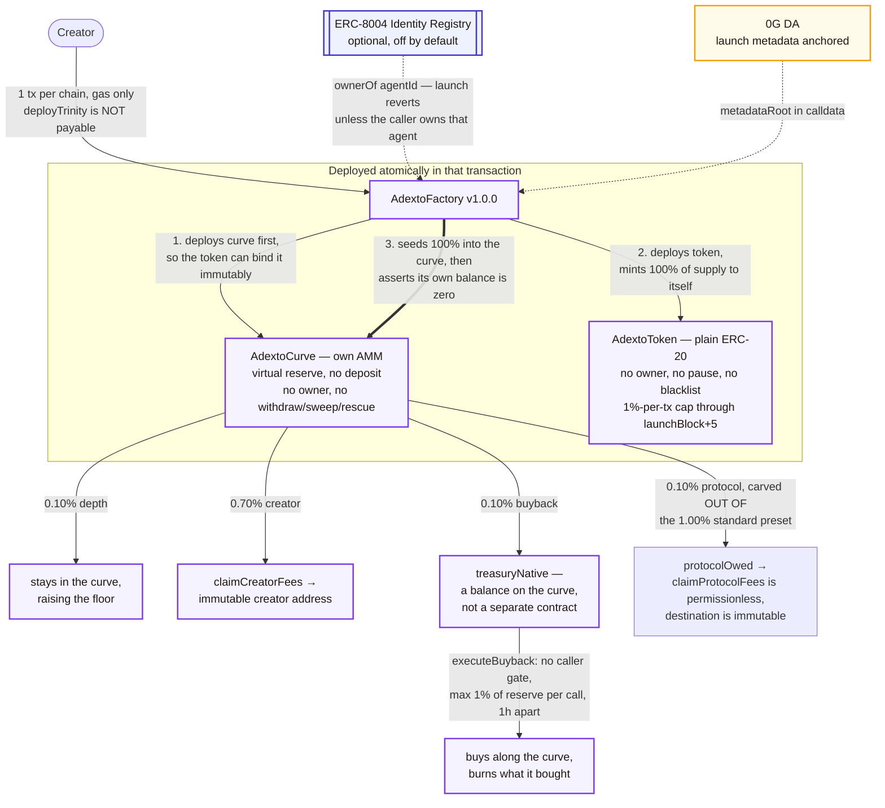

# ADEXTO Protocol (`adexto.xyz`)

**Market infrastructure for the agent economy.** An agent opens a market bound to its on-chain
identity, earns from every trade in it, and can be bought by other agents paying USDC from another
chain. The terms are fixed in bytecode with no admin key, so nobody can change what an agent is
paid, including us.

| | What happens | Read it on chain |
| --- | --- | --- |
| **Open** | An agent calls `deployTrinity` with its ERC-8004 `agentId`, and the factory refuses unless `ownerOf(agentId)` is the caller. Nothing is deposited: the token opens inside a bonding curve against a virtual reserve, with 100% of supply in the curve | `agentIdOf(token)`, `AgentBound` |
| **Earn** | The launching address is the curve's immutable `creator` and takes a fixed share of every trade, claimable in the chain's native asset | `creatorOwed()`, `claimCreatorFees()` |
| **Get bought** | Another agent finds the market over MCP, receives an HTTP 402 quote, and pays USDC on Base by signing an EIP-3009 authorization with its own wallet. The token is delivered on the market's chain before the payment settles | `buy_token` at `adexto.xyz/api/mcp` |
| **Verify** | Fees, treasury and supply are readable before anyone trades, and there is no owner, proxy, pause or withdraw function | `totalFeeBps()`, `protocolTreasury()` |

Launchpads are built for people clicking buttons. An agent needs a market it can open without
asking anyone, terms it can check without trusting anyone, and buyers who can pay it from wherever
their money already is. Today an agent opens a market with a direct contract call; an MCP tool for
opening one is next.

**Live on 0G, Base, Arbitrum One and Monad** from one byte-identical factory. The contracts, tests
and web app live here; the chain-specific engineering lives in
[`0xcuy/adexto-arbitrum`](https://github.com/0xcuy/adexto-arbitrum) and
[`0xcuy/adexto-monad`](https://github.com/0xcuy/adexto-monad).

[](https://adexto.xyz)
[](contracts/)
[](https://adexto.xyz/explorer)
[](https://adexto.xyz/mcp)
[](#erc-8004-agent-identity)
[](#-mainnet-deployments)
[](https://adexto.xyz/x402)

---

## What this is

A launchpad hands a creator a token and a page. Here one transaction opens a **working venue**, whether an agent or a person sends it, and these arrive with it — none of them a roadmap item, none needing a listing or an application:

| What arrives | What it means |
|---|---|
| **Machine buyers** | An MCP server exposes the markets to AI agents — discover, quote, buy, read history — resolved from the same registry the site uses, so a new market answers on the first request. |
| **A cross-chain price** | A buyer holding only USDC on Base takes a position without bridging and without ever holding the market's gas token. Paid over plain HTTP with an EIP-3009 authorization the token contract verifies itself; settled with real funds. |
| **Creator earnings in one place** | [`/creator`](https://adexto.xyz/creator) reads every curve an address created, on every chain, and claims the fees per market or per chain in one transaction. |
| **An agent for the market** | Answers questions about its own curve, fee split and depth. It carries its token and curve addresses because it is bound to them, and inference runs on the 0G Compute router. |
| **A trading terminal** | For the people who trade beside the agents: candles from one second up, with 1y and All ranges, RSI, MACD, Bollinger, VWAP, your own and the creator's trades marked on the chart, a curve depth ladder, a trade feed you can filter to your fills, the creator's or large ones, your position with PnL, the holder list, a watchlist and share cards — usable on a market that is minutes old. |

Launching is built to be quick to decide on. The studio shows what the launch will cost on the chain you picked before you sign, its default **Express** mode needs only a name, a ticker and an image, and the success screen drafts the announcement for X and Farcaster. Beside the markets, every market can be staked from its first block, and [Agent Compute](https://adexto.xyz/agent-compute) gives a staker an API key to an OpenAI-compatible endpoint on the 0G Compute router: with tiered allowances for $ADEXTO on 0G and `$SAI` on Monad, Arbitrum One and Robinhood Chain, and with an allowance funded by the market's own trading for every other market.

What is **not** here: no autonomous trading bot runs a market on a creator's behalf. ERC-8004 identity binding is real and verified on-chain at launch, but it is opt-in and it records an identity rather than starting a strategy.

### How the market itself works

The token opens **inside a bonding curve against a virtual reserve**. There is nothing to seed, so a launch costs gas and nothing else. 100% of supply enters the curve, so the creator holds no allocation to sell. Income arrives instead as a share of every swap, taken from inside the fee the trader already pays: on the studio's standard preset a trade costs 1.00% and 0.70% of it goes to the creator. Nothing is added on top. Markets created by the previous factory keep their own rates permanently. Full breakdown in [Fee split](#fee-split).

The curve is the permanent venue. There is **no graduation step** and no migration into an external pool, which is where most launchpad exploits have historically happened. There is also no withdrawal function anywhere in the curve, so no one — including us — can drain a market.

That is a statement about the protocol, not a restriction on the token. A v1 `AdextoToken` limits every receiving wallet to 1% of supply only while `block.timestamp < launchTime + 180` (the six 0.11.0 tokens capped single transfers for their first 5 blocks); after that `_update` adds no condition at all, and there is no blacklist, no pause, no `Ownable` and no permanent transfer hook. It is a plain ERC-20. So **anyone can list one of these tokens on any external AMM without our permission, and we could not stop it** — a second market with its own price can exist alongside the curve. The guarantee is narrower than "one market": *we* never migrate, and nobody can withdraw the curve's reserves.

### Fee split

Every swap pays four legs: creator, depth, buyback and protocol. Each rate is fixed when the market is created, and where the protocol leg sits depends on the factory generation that created it.

**ADEXTO v1 (`AdextoFactory` `1.0.0`), which every launch from the studio uses.** The creator configures a total, and that total is exactly what a trader pays. The protocol's 0.10% is carved out of it rather than added on top. The studio's standard preset, which a curve reports as `totalFeeBps` 100:

| Share | Bps | Goes to |
|---|---|---|
| Creator | 0.70% | streamed to the creator's wallet on every swap |
| Depth | 0.10% | stays in the curve, raising the price floor as volume accumulates |
| Buyback | 0.10% | accrues on the curve as `treasuryNative`; a buyback call spends it on the curve and burns what it bought |
| Protocol | 0.10% | `protocolOwed`, claimable only to the factory's immutable `protocolTreasury` |
| **Trader pays** | **1.00%** | |

**`AdextoFactory` `0.11.0`, which created the six markets listed today.** Its protocol leg is charged **on top of** the configured total. Those markets were configured at 0.30%, so a trader pays **0.40%** on them, permanently:

| Share | Bps | Comes from | Goes to |
|---|---|---|---|
| Depth | 0.15% | inside the creator's 0.30% | stays in the curve |
| Creator | 0.10% | inside the creator's 0.30% | streamed to the creator's wallet |
| Buyback | 0.05% | inside the creator's 0.30% | `treasuryNative`, spent on buy-and-burn |
| Protocol | 0.10% | **added on top** | `protocolOwed`, claimable only to the immutable `protocolTreasury` |
| **Trader pays** | **0.40%** | | |

Read `totalFeeBps()` on the curve instead of adding these up. It is the contract's own answer to what a trade costs, whichever generation created the market.

The protocol leg is a `public constant PROTOCOL_FEE_BPS` on the factory and an `immutable protocolFeeBps` on each curve, with **no setter in either**. A setter would make the contracts owned, which is the opposite of what `/security` claims about them. So a `0.11.0` market can never move its leg inside the total: its rates are immutable too. That is permanent, not a migration waiting to happen.

`claimProtocolFees()` is permissionless — anyone may call it, and the native always lands at the immutable treasury. No key is needed to collect the fee. The treasury's key is only needed by its owner, later, to move the money elsewhere.

The studio's three presets (0.60% / 1.00% / 2.00%) are UI only. The v1 contract accepts any split subject to `swapFeeBps <= 500` and `creatorShareBps + treasuryShareBps + PROTOCOL_FEE_BPS <= swapFeeBps`, so the 5% cap applies to what a trader pays and there is always room for the protocol leg. Depth is the residual, not an input: the factory computes `swapFeeBps − creatorShareBps − treasuryShareBps − PROTOCOL_FEE_BPS`, and the curve re-checks the sum against its own ceiling. On `0.11.0` the cap read `swapFeeBps + PROTOCOL_FEE_BPS <= 500` and depth was `swapFeeBps − creatorShareBps − treasuryShareBps`.

The buyback is permissionless and self-contained. `executeBuyback` carries only `nonReentrant` and `live` — no caller gate — so **anyone** can trigger it, capped at 1% of the native reserve per call. v1 curves also wait one hour between calls. The native never leaves the contract: the call moves `treasuryNative` into the curve reserve and burns whatever that purchase bought, so supply falls without paying anyone. That is deliberate — a burn path that depended on us being willing to run it would be a promise rather than a mechanism. It is not automatic either: the buyback share accrues on every swap, but a burn happens only when someone calls it. Our x402 gateway does after a delivery once the bucket covers three times the gas, and so far only `$ADEXTO` has burned anything.

---

## ⚙️ What one launch creates


```mermaid
graph TD
    Creator([Creator]) -->|1 tx per chain, gas only<br/>deployTrinity is NOT payable| Factory[AdextoFactory v1.0.0]

    Registry[[ERC-8004 Identity Registry<br/>optional, off by default]] -.->|ownerOf agentId — launch reverts<br/>unless the caller owns that agent| Factory
    Meta[0G DA<br/>launch metadata anchored] -.->|metadataRoot in calldata| Factory

    subgraph "Deployed atomically in that transaction"
        Factory -->|1. deploys curve first,<br/>so the token can bind it immutably| Curve[AdextoCurve — own AMM<br/>virtual reserve, no deposit<br/>no owner, no withdraw/sweep/rescue]
        Factory -->|2. deploys token,<br/>mints 100% of supply to itself| Token[AdextoToken — plain ERC-20<br/>no owner, no pause, no blacklist<br/>1%-per-tx cap through launchBlock+5]
        Factory ==>|3. seeds 100% into the curve, then<br/>asserts its own balance is zero| Curve
    end

    Curve -->|0.10% depth| Depth[stays in the curve,<br/>raising the floor]
    Curve -->|0.70% creator| CreatorFee[claimCreatorFees →<br/>immutable creator address]
    Curve -->|0.10% buyback| Vault[treasuryNative —<br/>a balance on the curve,<br/>not a separate contract]
    Curve -->|0.10% protocol, carved OUT OF<br/>the 1.00% standard preset| Protocol[protocolOwed →<br/>claimProtocolFees is permissionless,<br/>destination is immutable]

    Vault -->|executeBuyback: no caller gate,<br/>max 1% of reserve per call, 1h apart| Burn[buys along the curve,<br/>burns what it bought]

    classDef live fill:#f5f3ff,stroke:#7c3aed,stroke-width:2px,color:#201810;
    classDef partial fill:#fffbeb,stroke:#f59e0b,stroke-width:2px,color:#201810;
    classDef ext fill:#eef2ff,stroke:#4338ca,stroke-width:2px,color:#201810;
    class Factory,Token,Curve,Depth,CreatorFee,Vault,Burn live;
    class Meta partial;
    class Registry ext;
```

Three things in that picture exist but are **not** part of `deployTrinity`:

- **`agentIdentity` is just an address.** It is required non-zero and stored immutably on both the token and the curve, and it may call `executeTreasuryBuyback` to burn tokens it holds itself. It is not automatically the 0G Compute agent — the studio passes the creator's own wallet by default.
- **The x402 edge is a customer of the curve, not an operator of it.** It calls `buy` with the payer as recipient, exactly like any other address, and it holds no privileged position: it cannot deposit into `treasuryNative`, which fills only from the buyback leg of swap fees. The 0G Compute agent is an inference route and holds no key to anything on-chain. See [agent-to-agent](#agent-to-agent-where-the-loop-closes-and-where-it-breaks).
- **The buyback burns, but nobody is in charge of it.** `executeBuyback` carries only `nonReentrant` and `live` — no caller gate — so anyone may trigger it, bounded to 1% of the reserve per call and, on v1 curves, one call per hour.

---

## 🏛️ Mainnet deployments

Every address below was confirmed to hold bytecode by a direct `eth_getCode` call against the chain's RPC. Testnet deployments are deliberately not listed here — they belong in the operator runbook, not in the public README.

**ADEXTO v1** (`AdextoFactory` `VERSION` `1.0.0`) is the current, executable generation, broadcast on 2026-10-01 to five mainnets: it deploys the token and its curve in one transaction, needs no liquidity deposit, can bind an ERC-8004 agent identity, takes its 0.10% protocol fee out of the total the creator configures, and gives every market a 180-second launch window in which no wallet may hold more than 1% of supply. Every new launch goes through it.

Its runtime bytecode is **byte-identical across all five chains (21,806 bytes, keccak `0x1ca02ca53a3b2a2082f9e5dab6924e1339110e3037608f750981699678881fd4`)** and reproducible from source at commit [`71b5adfe774ed7a93f9fe589b4430c8122febb1f`](https://github.com/0xcuy/adexto/commit/71b5adfe774ed7a93f9fe589b4430c8122febb1f) with `node scripts/compile-contracts.mjs --via-ir` (solc 0.8.37, EVM cancun, 200 runs, via-IR): the compiled output differs from the chain only in the two slots that hold the immutable `protocolTreasury`. With those two slots zeroed, the code on every chain and the compiled artefact hash to the same `0x0e70cb93fbb10b66109cc71d547329cb48b4c3953791c2c4609519ff92221d62`. **Sourcify reports an exact match, creation and runtime, on all five chains.** A shallow clone (`git clone --depth 1`) does not contain that commit; fetch it by its full hash first, `git fetch --depth 1 origin 71b5adfe774ed7a93f9fe589b4430c8122febb1f && git checkout FETCH_HEAD`, or clone without `--depth`. [`/security`](https://adexto.xyz/security#verify) has the commands to check each of these yourself.

Byte-identical is not automatic here. `protocolTreasury` is `immutable`, and Solidity puts immutables **inside** the runtime bytecode, so the hashes match only because the same treasury was used on every chain. One chain with a different treasury and the claim is false. The reserved tickers differ by chain (Robinhood Chain reserves more, see [A note on reserved tickers](#a-note-on-reserved-tickers)), but they live in storage, not in the code.

`0.11.0` is listed alongside it because the six earlier markets were created by it, and they keep its rates permanently. Each row states its `VERSION` as read from the contract.

**AdextoStakeHub** (`VERSION` `1.0.0`) is the stake contract for every market that does not have its own `AdextoAgentStake`: one per chain, broadcast on 2026-10-01 from commit [`f8328ab43375c8a785ccf86fb4dfe39c83c2986f`](https://github.com/0xcuy/adexto/commit/f8328ab43375c8a785ccf86fb4dfe39c83c2986f). It accepts a token only when one of the factories fixed in its constructor returns a curve for it from `curveOf`, which only a launch writes, so a new market is stakeable from its first block with nothing deployed for it. It refuses the four tokens that have their own stake, so no market has two stake contracts. The minimum is 0.001% of the token's current supply. There is no owner, pause, lock or reward. Its runtime is **byte-identical across all five chains (4,278 bytes, keccak `0x88247303e4851282bbf22dd4f23e753b08a6862ea40f32d9c0464e92730b081a`)** because it has no immutables: the factory and exclusion lists live in storage. **Sourcify reports an exact match, creation and runtime, on all five chains.**

### 0G Mainnet · chain ID 16661

| Contract | Address | Notes |
|---|---|---|
| **AdextoFactory** | [`0xEBbE0fB112859b57A0ad1afbeD4978e43dC96c5D`](https://chainscan.0g.ai/address/0xEBbE0fB112859b57A0ad1afbeD4978e43dC96c5D) | **current** · ADEXTO v1 · `VERSION` `1.0.0` · 21,806 B · block 45793987 · `PROTOCOL_FEE_BPS` 10, carved out of the total · 16 tickers reserved |
| **AdextoFactory** | [`0x51c4168226463F7e5A141e1c6D30520734BC840a`](https://chainscan.0g.ai/address/0x51c4168226463F7e5A141e1c6D30520734BC840a) | superseded · `VERSION` `0.11.0` · 21,281 B · block 43704079 · `PROTOCOL_FEE_BPS` 10, charged on top · its markets keep these rates forever |
| ERC-8004 agent (ours) | [`3545431`](https://chainscan.0g.ai/address/0x8004A169FB4a3325136EB29fA0ceB6D2e539a432) | registered, owned by the deployer · id is chain-specific |
| AdextoAgentStake | [`0x5b44AEA7AC49C7a6DA8f700D991852A2970b9231`](https://chainscan.0g.ai/address/0x5b44AEA7AC49C7a6DA8f700D991852A2970b9231) | **live** · stakes $ADEXTO for [Agent Compute](https://adexto.xyz/agent-compute) and the market's agent (`ask_agent`) · `minStake` 5,000 · no `owner()` · 0G only |
| AdextoStakeHub | [`0x440B89416A3a907a7016F20A29DA18665269A52f`](https://chainscan.0g.ai/address/0x440B89416A3a907a7016F20A29DA18665269A52f) | **live** · every 0G market except $ADEXTO, from the v1 and `0.11.0` factories · minimum 0.001% of supply · block 45891788 · no `owner()` |

### Base Mainnet · chain ID 8453

| Contract | Address | Notes |
|---|---|---|
| **AdextoFactory** | [`0xF5f904ca7763Fc6755bbCe5466a9DBd4C15c2708`](https://basescan.org/address/0xF5f904ca7763Fc6755bbCe5466a9DBd4C15c2708) | **current** · ADEXTO v1 · `VERSION` `1.0.0` · 21,806 B · block 52008858 · `PROTOCOL_FEE_BPS` 10, carved out of the total · 16 tickers reserved |
| **AdextoFactory** | [`0x216E7880D64D94335B583c539802d3e61958d4A2`](https://basescan.org/address/0x216E7880D64D94335B583c539802d3e61958d4A2) | superseded · `VERSION` `0.11.0` · 21,281 B · block 50971523 · `PROTOCOL_FEE_BPS` 10, charged on top · its markets keep these rates forever |
| ERC-8004 agent (ours) | [`84622`](https://basescan.org/address/0x8004A169FB4a3325136EB29fA0ceB6D2e539a432) | registered, owned by the deployer · id is chain-specific |
| AdextoStakeHub | [`0x2ba1EcffCD624Dc18044531F3999F0445014240D`](https://basescan.org/address/0x2ba1EcffCD624Dc18044531F3999F0445014240D) | **live** · every Base market, from the v1 and `0.11.0` factories · minimum 0.001% of supply · block 52052214 · no `owner()` |

### Arbitrum One · chain ID 42161

| Contract | Address | Notes |
|---|---|---|
| **AdextoFactory** | [`0x79DF3671e7e7456832C84a34c2bC0DB7871C0E0E`](https://arbiscan.io/address/0x79DF3671e7e7456832C84a34c2bC0DB7871C0E0E) | **current** · ADEXTO v1 · `VERSION` `1.0.0` · 21,806 B · block 510474755 · `PROTOCOL_FEE_BPS` 10, carved out of the total · 16 tickers reserved |
| **AdextoFactory** | [`0xE17f1027FC5f294327D701829baeD9d6519e922C`](https://arbiscan.io/address/0xE17f1027FC5f294327D701829baeD9d6519e922C) | superseded · `VERSION` `0.11.0` · 21,281 B · block 502476317 · `PROTOCOL_FEE_BPS` 10, charged on top · its markets keep these rates forever |
| ERC-8004 agent (ours) | [`1457`](https://arbiscan.io/address/0x8004A169FB4a3325136EB29fA0ceB6D2e539a432) | registered, owned by the deployer · id is chain-specific |
| AdextoStakeHub | [`0xdf8891bA9fd8e3DC2E7D0A0ccae279247cd2ddf3`](https://arbiscan.io/address/0xdf8891bA9fd8e3DC2E7D0A0ccae279247cd2ddf3) | **live** · every Arbitrum One market except `$SAI`, from the v1 and `0.11.0` factories · minimum 0.001% of supply · block 510798163 · no `owner()` |

### Monad Mainnet · chain ID 143

| Contract | Address | Notes |
|---|---|---|
| **AdextoFactory** | [`0x3dFcBEd7dd889F465cC9f75c430B43Ef873b6056`](https://monadscan.com/address/0x3dFcBEd7dd889F465cC9f75c430B43Ef873b6056) | **current** · ADEXTO v1 · `VERSION` `1.0.0` · 21,806 B · block 109440540 · `PROTOCOL_FEE_BPS` 10, carved out of the total · 16 tickers reserved |
| **AdextoFactory** | [`0x5800e9715a47a598fce9bc3B65a95FD6BeBf76A3`](https://monadscan.com/address/0x5800e9715a47a598fce9bc3B65a95FD6BeBf76A3) | superseded · `VERSION` `0.11.0` · 21,281 B · block 102583076 · `PROTOCOL_FEE_BPS` 10, charged on top · its markets keep these rates forever |
| ERC-8004 agent (ours) | [`10247` and `10251`](https://monadscan.com/address/0x8004A169FB4a3325136EB29fA0ceB6D2e539a432) | both registered and both owned by the deployer · `10251` is the id `$PARCEL` and `$CURB` bind · ids are chain-specific |
| **SAi Monad** (`$SAI`) | token [`0xD873B033e2dffbF7E3107CD61E7156cE23B39f20`](https://monadscan.com/address/0xD873B033e2dffbF7E3107CD61E7156cE23B39f20) · curve [`0x6CA74a83eB8d7e9fbaBd443218d2554028eD35Ea`](https://monadscan.com/address/0x6CA74a83eB8d7e9fbaBd443218d2554028eD35Ea) | the first v1 market on Monad · bound to ERC-8004 agent `10275`, owned by its creator wallet · stake [`0xAadb44692dC4c9A1759361ea973B83aa7f36700e`](https://monadscan.com/address/0xAadb44692dC4c9A1759361ea973B83aa7f36700e) · all three exact matches on Sourcify |
| AdextoStakeHub | [`0xb89d17F7308Ac007b106EB400eB2A8CB51cf887A`](https://monadscan.com/address/0xb89d17F7308Ac007b106EB400eB2A8CB51cf887A) | **live** · every Monad market except `$SAI`, from the v1 and `0.11.0` factories · minimum 0.001% of supply · block 109727181 · no `owner()` |

### Robinhood Chain · chain ID 4663

An Arbitrum Orbit chain. ADEXTO v1 is the first generation here, so there is no superseded factory. Its first market is `$SAI` (SAi Robin).

| Contract | Address | Notes |
|---|---|---|
| **AdextoFactory** | [`0x8e63e117E71A80Cfc10fDF375F079e2e29cd7D7D`](https://robinhoodchain.blockscout.com/address/0x8e63e117E71A80Cfc10fDF375F079e2e29cd7D7D) | **current** · ADEXTO v1 · `VERSION` `1.0.0` · 21,806 B · block 76864198 · `PROTOCOL_FEE_BPS` 10, carved out of the total · 212 tickers reserved: the base 16, `USDG` and the 195 tokenized stocks active on the chain at deployment |
| AdextoStakeHub | [`0x05EFA7F066FcbefbE650EDd58583C107831A600B`](https://robinhoodchain.blockscout.com/address/0x05EFA7F066FcbefbE650EDd58583C107831A600B) | **live** · every Robinhood Chain market except `$SAI`, from the v1 factory · minimum 0.001% of supply · block 77733726 · no `owner()` |

The factory sits at the deployer's first-nonce address, and on Base and Monad that same address holds an unrelated pre-release contract. An address means nothing without its chain id.

**Deployer:** `0x8a3c7524Aaed081825aC88eC7f4cCECFc583ee7D`

**Protocol treasury:** [`0x24268Fffc119ec5550F68e80D94476fD64daE967`](https://chainscan.0g.ai/address/0x24268Fffc119ec5550F68e80D94476fD64daE967) — the immutable destination of the 0.10% protocol leg on every `0.11.0` and v1 curve. Deliberately not the deployer: that key is online and is already the `creator` of live markets, which would make protocol revenue and creator revenue indistinguishable on-chain. It was a fresh address with no code, nonce 0 and no balance on all four mainnets when it was chosen.

---

## 📋 Honest status

| Component | Works? | Exactly what that means |
|---|---|---|
| ADEXTO v1 (`AdextoFactory` `1.0.0`) on 5 mainnets | **Live, current** | Broadcast on 2026-10-01 by [`scripts/deploy-factory.mjs`](scripts/deploy-factory.mjs), which proved before sending that the artifact matched the committed sources, the chain executed the bytecode's `PUSH0` and `MCOPY`, and a simulated creation returned the artifact's runtime. Read back on each chain afterwards: `VERSION` `1.0.0`, `PROTOCOL_FEE_BPS` 10 carved out of the total, `protocolTreasury` equal to the address published above, runtime byte-identical across all five (21,806 B), and every reserved ticker unclaimable while a control ticker stayed free. Sourcify: exact match on all five. `totalProjectsCount` was `0` on every chain at that point; the live markets row below has today's count. |
| `AdextoFactory` `0.11.0` on 4 mainnets | **Live, superseded** | Superseded by v1, which moves the protocol leg inside the total and adds the per-wallet launch window. Still deployed and still permissionless, and its six listed markets keep their 0.40% permanently. Broadcast and read back on each chain: `VERSION` `0.11.0`, `PROTOCOL_FEE_BPS` 10, `protocolTreasury` equal to the address published above, `totalProjectsCount` 0 at deployment, and runtime bytecode byte-identical across all four (21,281 B). |
| `AdextoStakeHub` `1.0.0` on 5 mainnets | **Live** | Broadcast on 2026-10-01 by [`scripts/deploy-stake-hub.mjs`](scripts/deploy-stake-hub.mjs), which refused to send unless the source was committed and on `origin/main`, the artifact matched that source, every live market recorded for the chain in `onchain-launches.json` (other than the excluded four) came from one of the hub's factories, and a simulated creation returned the artifact's runtime. Read back on each chain afterwards: `VERSION` `1.0.0`, divisor `100000`, the factory and exclusion lists, every listed market eligible, and a control address refused. Sourcify: exact match on all five. One contract per chain keeps a separate position for every market and every call names its token, so a market launched after the hub is stakeable without a deployment. It is not on the launch path: a launch never calls it. Read on 2026-10-02: one position across the five hubs, 10,000 `$PARCEL` on Monad, staked by the deployer to test the path end to end (next rows). |
| Protocol fee revenue | **Live and collecting on the four chains with markets** | The leg is charged and accrues on every `0.11.0` and v1 curve. Read from chain on 2026-09-30: `0.000047209005338664 0G` has been claimed through to the treasury, and a further `0.001658416602021935 0G` sits accrued on the 0G curves waiting for a permissionless claim — plus `0.009076842980947345 MON` on Monad, `0.0000000803 ETH` on Base and `0.0000002001 ETH` on Arbitrum. The treasury's nonce is `0` on all four chains, so nothing has ever been spent out of it. The destination is `immutable` on each curve, so it cannot be redirected and there is no setter to try. |
| ERC-8004 agent binding | **Works. Optional, enforced at launch** | Pass an agent id at launch and the factory calls `ownerOf(agentId)`, reverting unless you own that agent. Leave it out and the launch is one transaction with no agent. Mainnet examples now include `$PARCEL` and `$CURB` on Monad (`agentId 10251`), the **first** `$ADEXTO` market on 0G (`agentId 3545431`), SAi Robin on Robinhood Chain (`agentId 6525`), SAi Arbitrum (`agentId 1566`) and SAi Monad (`agentId 10275`). All three `$SAI` agents are owned by the creator wallet that launched those markets, and their token pages read the immutable binding from the token contract. The live `$ADEXTO` reads `agentBound false` because its relaunch onto `0.11.0` dropped the binding and `agentBound` is immutable — the full account is in [ERC-8004 agent identity](#erc-8004-agent-identity). What is NOT used: the Reputation and Validation registries, and `supportsInterface`. So this integrates with one of the standard's three registries — it is not ERC-8004 compliance and this file does not call it that. |
| Launching through the site | **Enabled on five chains** | All five `NEXT_PUBLIC_CURVE_FACTORY_*` are set to the v1 addresses above, so the studio launches on the current generation, Robinhood Chain included. `NEXT_PUBLIC_CURVE_FACTORY_PREV_*` carries the `0.11.0` addresses for verification only and is deliberately excluded from every "can this chain launch" check. |
| Studio: cost card, Express mode, announcement drafts | **Live; exercised locally and by three mainnet launches** | Before you sign, a cost card shows the launch's gas on the chosen chain from that chain's live `eth_gasPrice` and gas units measured with `estimateGas` against the v1 factories, alongside "no liquidity deposit", "0 tokens to you" and the fee a trade pays there. Express, which the studio opens in, asks for a name, ticker, one-line pitch and image; `/studio?mode=advanced` exposes every setting. Both paths use the same launch function. Express, image upload and the compose links were exercised end to end on a local chain. The full Advanced path was then used on mainnet for SAi Robin, SAi Arbitrum and SAi Monad, including the 3D image generated from the pitch, public GitHub link, creator-owned ERC-8004 registration, attestation and launch transaction. |
| Creator earnings (`/creator`) | **Live; reads checked against chain, claims exercised on a local chain** | For any address it lists every market whose curve names that address as `creator()`, on every chain, with earnings to date (paid out plus claimable) in native units and dollars. For the deployer, all 14 markets it created were compared field by field with direct RPC reads and matched. Claims go per market through `claimCreatorFees`, or per chain in **one transaction** through the canonical Multicall3, whose code is identical on all five mainnets. Both claim paths were run on a local chain with the balance change checked to the wei; neither has been used for a mainnet claim yet. |
| Verify-it-yourself checklist (`/security`) | **Live** | Copy-paste `cast` commands per chain for the factory address, its creation block and transaction, runtime size and hash, `VERSION`, `PROTOCOL_FEE_BPS`, the missing `owner()`, the compiled source matching the deployed code, a market's fees read from its own curve, and the curve's state-changing functions — each with the answer the chain gave. Every command was run as printed against all five mainnets. The page also states what each check does not prove. |
| Live markets | **9, across all five mainnets** | `$ADEXTO`, `$ADT` and `$ZEEBO` on 0G, `$PARCEL` and **SAi Monad** (`$SAI`) on Monad, `$BLOOP` on Base, `$WOMBO` and **SAi Arbitrum** (`$SAI`) on Arbitrum One, and **SAi Robin** (`$SAI`) on Robinhood Chain. The same ticker on several chains names separate markets with separate supply and price; clients select one with `chainId`. `totalProjectsCount` on the current v1 factories reads `0 · 0 · 1 · 1 · 1` for 0G, Base, Arbitrum, Monad and Robinhood; the older factories remain part of the inventory because their markets cannot be removed. Every launch that exists on chain is recorded once in [`src/config/onchain-launches.json`](src/config/onchain-launches.json) with its status — live, superseded, or a throwaway test ticker from a demo recording — and `audit_consistency.mjs` fails the build if an on-chain launch appears that the file does not account for. `allProjects` is append-only with no delete, so the factories' raw counter can only rise; it is not a growth number and is not quoted as one. |
| Trading / swap | **Live on all five mainnets, and nearly all of it is ours** | Real fills exist on every chain. The 2026-09-30 snapshot was `$ADEXTO` `27`, `$PARCEL` `16`, `$ZEEBO` `6`, `$WOMBO` `5`, `$BLOOP` `2`, `$ADT` `1`, and the delisted `$CURB` `5`. On 2026-10-01 the two v1 `$SAI` curves each received their first buy: a direct terminal buy on Robinhood Chain and an x402 delivery on Arbitrum One, bringing the listed-market count to 59 fills and 64 with `$CURB`. Almost every fill was made by us: the deployer's own test trades, a demo creator wallet, and x402 deliveries through our relayer. The one exception recorded before these demos is an x402 delivery on `$ADEXTO` on 2026-09-28 to an address that is not the deployer. So this proves the trade paths work, not that there is outside demand. The sell leg matters most: it goes `approve` then `sell` against the curve, which is the exit path a bonding curve is usually accused of not having. |
| MCP server for AI agents | **Live, 14 tools** | `https://adexto.xyz/api/mcp` answers `tools/list` with `list_markets`, `get_market`, `quote_buy`, `how_to_pay`, `buy_token`, `pay_and_buy`, `trade_history`, `check_stake`, `access_message`, `ask_agent`, `prepare_launch`, `register_launch`, `prepare_stake` and `prepare_claim`, resolved from the same registry the site reads, so a market launched a minute ago answers on the first request. It serves the 2026-07-28 MCP revision (stateless, `server/discover`) and 2025 clients that open with `initialize`. The `prepare_launch`, `register_launch`, `prepare_stake` and `prepare_claim` tools let an agent launch, stake and claim with its own key: the server returns unsigned transactions and never holds a key. Markets bound to an ERC-8004 agent are listed with an on-chain Agent Score at [/agents](https://adexto.xyz/agents). A ticker can trade on more than one chain, so the market tools and the x402 gateway take a `chainId` (`?chain=` on the gateway); without it the oldest market for that ticker is used. `ask_agent` answers only an address whose stake in that market's stake contract (its own, or its chain's stake hub) is active, proven with a signed `access_message`. `pay_and_buy` is the one that finishes a purchase, and it is honest about how: **the signature is made by the operator's key on this server, not by a wallet the model controls.** It is gated on an `x-agent-key` header, capped at `0.20 USDC`, and every term — recipient, asset, amount — is taken from the gateway's own challenge rather than from the model, so a fully prompt-injected agent can at most buy one of our own markets and send the money to our own treasury. |
| Own AMM (`AdextoCurve`) | **Deployed per launch** | The curve ships with the factory, one per market. |
| Agent inference (0G) | **Works** | The market agent's chat runs through the 0G Compute Router (`glm-5.3` by default). The router reports each model as Intel TDX attested via dstack and we print exactly what it reports — that label is the router's word, attributed to it, because we do not fetch or verify the raw quote ourselves. |
| Agent Compute (stake for an API key) | **Live on all five mainnets; tiered on four stakes, fee-funded on every other market** | Stake at least 5,000 $ADEXTO in `AdextoAgentStake` on 0G, or at least 10,000 `$SAI` in a `$SAI` market stake on Monad, Arbitrum One or Robinhood Chain (next row), and the address gets an API key for that token, for an OpenAI-compatible endpoint at `https://compute.adexto.xyz/v1`, serving `0g/deepseek-v4-flash` on the 0G Compute router. Keys are per token: the page is a checklist, each ticked token has its own stake, its own key and an allowance set by that token's stake tier, and the signed message names the token. **Every other market** is on the list too, read from the registry, so a new launch appears without a code change: stake at least 0.001% of its supply in its chain's `AdextoStakeHub` and the key has no tier. Its allowance accrues from 50% of the 0.10% protocol fee that market's trades pay, valued at the native price when the sweep reads the curve and converted at $0.3168 per million model tokens (0G's price for the model, blended 90/10 input to output), shared by stake, and counted only from fees paid after the key was issued. A hub key therefore opens with nothing and stays switched off on the router until at least one minimal request's worth (823 tokens) has accrued, and a market nobody trades funds no compute; at today's price about $0.52 of trading pays for one minimal request. Exercised end to end on Monad on 2026-10-02, entirely by the deployer: a key issued against its `$PARCEL` hub stake opened switched off with nothing accrued, a 10 MON buy-and-sell round trip paid `0.01996 MON` of protocol fees, the next sweep credited the key `1,059` tokens (the market's earlier fees were not shared) and switched it on, it served requests, and once the router had recorded 831 tokens of use the following sweep switched it off with 228 left, under one request's worth. The key was then revoked. A key is shown once and not stored by the site. Read from chain on 2026-09-30: one staker, 10,000 $ADEXTO staked. Only the stake is on-chain; the allowance is enforced by a periodic sweep of the router's usage, so a key can overshoot by up to one sweep. |
| Market staking (`ask_agent`) | **Live on every market** | Four markets have their own `AdextoAgentStake`, and every other market, including each new launch, stakes in its chain's `AdextoStakeHub` (addresses in [Mainnet deployments](#-mainnet-deployments)) from its first block, with a minimum of 0.001% of its supply. The four dedicated stakes are the $ADEXTO stake on 0G (Agent Compute row above, minimum 5,000 ADEXTO, listed as a market stake on 2026-10-01 so its token page and `ask_agent` read it too) and `AdextoAgentStake` for `$SAI` on Arbitrum One at [`0x2fc2A49ea2e4357541Dda9488DCeadCD0c43B508`](https://arbiscan.io/address/0x2fc2A49ea2e4357541Dda9488DCeadCD0c43B508), for `$SAI` on Robinhood Chain at [`0x01b250a2db25561dB185f4628B93C72048D8bc1B`](https://robinhoodchain.blockscout.com/address/0x01b250a2db25561dB185f4628B93C72048D8bc1B) and for `$SAI` on Monad at [`0xAadb44692dC4c9A1759361ea973B83aa7f36700e`](https://monadscan.com/address/0xAadb44692dC4c9A1759361ea973B83aa7f36700e), each deployed by `scripts/deploy-market-stake.mjs` after its market launched: minimum 10,000 SAI, no owner, no lock and no reward, exact match on Sourcify. A stake in either contract opens that market's agent over MCP: `ask_agent` checks `isActive` on the contract (on the hub, for that token) for the signer of an `access_message`, and answers from facts read on-chain for that call. The same stake also counts toward an Agent Compute key (previous row). Every token page shows a stake panel, using the market's own contract where `src/config/market-stakes.ts` lists one and the hub otherwise. |
| x402 edge gateway | **Settles on Base; delivery wired on all five mainnets** | Quote, payment and delivery run through the same endpoint. Paid deliveries have been exercised on 0G, Base, Arbitrum One and Monad; Robinhood Chain is wired and its `$SAI` quote is live, but no paid x402 delivery has been sent there yet. `DELIVERY_RPC` maps the selected market's `chainId` to its own endpoint, and `?chain=` disambiguates a ticker such as `$SAI` that trades on more than one chain. USDC is taken on Base through an EIP-3009 authorization and the curve on the target chain sends the tokens to the buyer's address. Delivery runs before the charge, so a failed fill costs us and never the buyer. The 2026-10-01 `$SAI` Arbitrum take delivered `24,013.3828 SAI` in [`0xbed111…3773b0`](https://arbitrum.blockscout.com/tx/0xbed111e865d325f24ca68fb9bdb44f87f3e979e78b706e967791a3e8e23773b0), then settled `0.10 USDC` on Base in `0xe76dd0…4d797`; the buyer's transaction count stayed unchanged on both chains. Earlier fills, all `status 1` and submitted by relayer `0xDe1f…C627`, include `$PARCEL` on Monad, `$WOMBO` on Arbitrum, `$BLOOP` on Base and `$ZEEBO` on 0G. An x402 delivery is an ordinary `buy`, which is why it pays the same fee legs and grows the buyback vault without routing revenue between chains. See [x402 edge](#x402-edge). |
| 0G DA metadata anchoring | **Live** | Launch metadata is anchored and its storage root travels in calldata as `metadataRoot`. All eight listed markets carry a `daStorageTx`; both `$SAI` launches produced a storage transaction on 2026-10-01. The upload now gives up after 45 seconds if the 0G storage node stays behind the chain: the launch then continues with a keccak commitment to the metadata bytes and reports `daStorageOk: false`, rather than waiting until the reverse proxy replaces the API response with an HTML timeout page. |
| The Graph indexing | **Live on Base and Arbitrum for the `0.10.0` and `0.11.0` factories — not yet for v1** | `adexto-base` and `adexto-arbitrum` at `v0.11.1` are synced to the chain head with `hasIndexingErrors: false`, and each returns its market with the numbers the curve stores: read on 2026-09-30, `$BLOOP` `swapCount 2` and `volumeNative 80300218841094` on Base, `$WOMBO` `swapCount 5` and `200113996278028` on Arbitrum. The manifest has no data source for the v1 factories, so a market launched there today is not in either subgraph; the site reads it from RPC logs and the market index instead (next row). 0G and Monad are not served by The Graph at all. Not published to the decentralized network. Detail in [The Graph](#the-graph). |
| Trade history, holders and positions | **Complete from each market's launch block** | `src/lib/market-index.ts` keeps an index per market of every token `Transfer` and curve `Swap` since the launch block, stored on disk and extended from the last scanned block on each request, a few confirmations behind the head so a reorg cannot plant a phantom transfer. It is what makes the holder list, your position and its PnL, and chart history older than the log window possible. A backward RPC scan of 16 calls still supplies the newest fills, and an indexer answers first where one serves the chain (Envio on Monad, The Graph on Base and Arbitrum). `eth_getLogs` spans are measured per chain, not assumed — 0G now refuses anything over 100,000 blocks — and `audit_consistency.mjs` probes each configured span against the live RPC on every run, because an over-wide range fails in a way the UI cannot tell apart from "no trades yet". **One gap:** the MCP `trade_history` tool still uses only the 16-call scan, which on 0G reaches 1,440,000 blocks back — short of `$ADEXTO` and `$ADT`, launched about 2,030,000 blocks ago. It says so in its answer (`complete: false`) rather than presenting a short list as the whole history. |
| Envio indexing (Monad) | **Live, full history for `0.11.0`** | [`envio/`](envio/) indexes `AdextoFactory` `0.11.0` and every curve it deploys on chain 143; read on 2026-09-30 it is synced to the head and reports `$PARCEL` at `swapCount 16`, the same as the curve. It does not index the v1 Monad factory yet, so a v1 launch on Monad is read from RPC logs and the market index. HyperSync covered all 1.93M blocks since the `0.11.0` factory was deployed in under 45 seconds; the same range over `rpc.monad.xyz` takes about six hours, because that endpoint caps `eth_getLogs` at 100 blocks. Built as its own indexer rather than one more network on the subgraph because `graphprotocol/networks-registry` lists `monad` **without** Subgraphs support — Firehose and Substreams only. Verified against contract storage rather than against itself: 22 figures per market including the live fee ledger. Requires a free `ENVIO_API_TOKEN`. [Details](envio/README.md). |
| No admin surface | **Guaranteed by the contracts** | Every fee rate is `immutable`, nothing on the launch path has an owner or a setter, and there is no withdrawal function in the curve. So no rate can be redirected, no market can be drained, and no upgrade can change the terms a trader agreed to. This is the protocol's central guarantee, and it is checkable in `contracts/` rather than promised. |

### Why a bonding curve rather than a liquidity pool

The reason is the launch model, and it is checkable in the contracts rather than a matter of taste.

| | this curve | a standard liquidity pool |
|---|---|---|
| Capital to open a market | none — the native side starts entirely virtual, and `deployTrinity` is not `payable`, so it cannot accept a deposit | real liquidity must be deposited by someone |
| Creator's token position | none — the whole supply is minted to the factory and loaded into the curve in the same transaction, and the factory then requires its own balance to be zero before the launch can succeed | the creator must hold tokens to pair with liquidity |
| Can reserves be pulled out | no — there is no `withdraw`, `rescue`, `sweep`, `drain` or `emergency` function anywhere, no owner and no `onlyOwner`; native leaves only as a seller's payout or as a fee claim to an immutable address: the creator's on every curve, plus the protocol's on `0.11.0` and v1 curves | yes, and correctly so: a provider may withdraw at any time |
| Migration step | none — the curve is the permanent venue | the usual launchpad pattern graduates a curve into a pool, and that step is where much of the historical exploit surface lives |
| Creator fee | a share of every swap accrues on-chain inside the total the trader pays (0.70% of 1.00% on the studio's standard preset), so paying the creator costs the trader nothing extra | fees accrue to liquidity providers; paying a creator needs custom hook support the venue may not offer |
| Code paths across our four chains | one, byte-identical | whatever venue happens to exist per chain |

Row three carries the weight. A liquidity provider being able to withdraw is not a flaw — it is what an AMM is for — but it means the venue can be pulled out from under holders, and "we won't" is only a promise. Here the guarantee is the absence of code that could do it.

### ERC-8004 agent identity

**It works, and it is off unless you ask for it.** Pass an agent id at launch and `AdextoFactory` calls `ownerOf(agentId)` on the [ERC-8004](https://eips.ethereum.org/EIPS/eip-8004) Identity Registry, refusing the launch unless you own that agent — so a token cannot attach itself to somebody else's identity and inherit its reputation. Leave the id out and the launch is one transaction with no agent attached.

**Scope, stated precisely: this integrates the Identity Registry.** The standard has three registries, and ownership is the one that matters at launch — the factory calls `ownerOf(agentId)` and reverts unless the caller owns that agent. Reputation and Validation are outside what a launch needs, so they are not touched, and `supportsInterface` is not implemented. Calling this "ERC-8004 compliance" would overstate one registry into three.

| | |
|---|---|
| Identity Registry | `0x8004A169FB4a3325136EB29fA0ceB6D2e539a432` — same address on all five mainnets, verified answering `ownerOf` |
| Our own agent | **registered on all four mainnets** — Base `84622`, Arbitrum One `1457`, 0G `3545431`, Monad `10247` and `10251`, every one of them confirmed by `ownerOf` as owned by the deployer. Monad has two because a second was registered during the Monad work; `10251` is the id the live markets there actually bind |
| Exercised at launch | **on 0G and Monad.** `$PARCEL` and the delisted `$CURB` read `agentBound true, agentId 10251`. The first `$ADEXTO` market read `agentBound true, agentId 3545431` too — and **the live one does not, because a relaunch dropped it.** See below |
| Regression, stated because it is permanent | **the live `$ADEXTO` market lost its binding.** The `0.10.0` market at `0x0860a80f…37C6` is bound to `3545431`. Relaunching onto `0.11.0` to gain the protocol fee leg sent `bindAgent: false`, hard-coded in `scripts/relaunch-market.mjs` while that same script was carefully preserving every fee rate. `agentBound` is `immutable`, so `0xA1358C17…1DF7` can never be bound; only another relaunch would fix it. The script now reads the old token's binding and carries it forward, refuses to proceed if the agent is no longer ours, and asserts `agentBound` on the newly born token before touching the registry |
| Registry on testnets | **absent**, so the agent path can only be exercised on mainnet or a local devchain |
| Status of the standard | EIP-8004 is a **Draft**, so what we integrate against can still change. This is about the EIP, not about our code |
| Who controls the registry | **not us.** It is an upgradeable proxy owned by a third party, so its behaviour can change without our involvement or consent |
| Reputation / Validation registries | **not used** |
| Read on a token | `agentBound()`, then `agentId()` and `agentRegistry()` |

Five things that will bite you otherwise, and the first one already bit us.

**A relaunch drops the binding unless something carries it.** The first `$ADEXTO` market, created by the `0.10.0` factory at [`0x0860a80f…37C6`](https://chainscan.0g.ai/address/0x0860a80f6fF87423c3cC379199700576857437C6), reads `agentBound true`, `agentId 3545431`, `agentRegistry 0x8004A169…a432`. It was relaunched onto `0.11.0` so the market would pay the protocol fee leg, and the live market at [`0xA1358C17…1DF7`](https://chainscan.0g.ai/address/0xA1358C17004469C7CA5365AbafD294F9b2c11DF7) reads `agentBound false`, `agentId 0`, registry at the zero address.

Nothing failed. `scripts/relaunch-market.mjs` sent `bindAgent: false` and `agentId: 0` as literals, in the same file that goes to deliberate trouble to preserve every fee rate so that "the only difference is the protocol leg". The transaction succeeded, every post-launch check passed, and no line ever read `agentBound()` on the token it had just created. Because `agentBound` is `immutable`, the live market can never be bound — only another relaunch would restore it, and that would abandon the market's trading history.

The script now reads `agentBound()`, `agentId()` and `agentRegistry()` off the old token, checks `ownerOf(agentId)` still returns the deployer and **stops** rather than proceeding unbound, passes the id through to `deployTrinity`, and then reads the binding back off the newly created token before the registry is touched. A correct argument and a correct result are two different things, and this bug lived in the gap between them.

**An agent id means nothing without its chain.** The registry sits at one address on all four mainnets, which invites the assumption that an id is global. It is not — each registry keeps its own state, and `ownerOf(0)` returns three *different* owners across the four chains. Our own registrations came back `84622` on Base, `1457` on Arbitrum, `3545431` on 0G and `10247` on Monad for the same agent — plus `10251`, a second Monad registration, which is the one the live Monad markets bind. Launching four chains with one id binds on the chain it came from and reverts on the rest with `Factory: agent not owned by caller`, after gas has been spent on each. Register once per chain and pass that chain's id.

**Binding is a separate step from launching.** ERC-8004 wants the registration file to contain its own `agentId`, and the id does not exist until `register()` returns — so a file pinned beforehand cannot contain it. The creator registers first and passes the id to the launch. Leaving the identity off keeps the launch at one transaction, which is why the gas-only property is unaffected.

The studio can do the registration itself: one `register()` transaction from the creator's own wallet on the chosen chain, after which the new id is read from the mint event and filled into the launch form. That file is built before the id exists and the studio deliberately skips a second `setAgentURI` transaction, so it does not carry its own `agentId`, and it has no `registrations` entry pointing back at the identity. `scripts/register-agent-8004.mjs` takes the longer route and writes a file that does.

**`agentBound()` is the flag to read, not `agentId()`.** Agent id 0 is a real agent with a real owner on 0G, Base, Arbitrum One and Monad, so zero cannot mean "no agent". An earlier revision of this used `agentId == 0` as that sentinel; testing against the live registries caught it before it was frozen into immutable bytecode.

**The registration file is `data:` until IPFS pinning is configured.** ERC-8004 permits a base64 `data:` URI for fully on-chain metadata, and that is the default here because an `ipfs://` CID that nobody pins is a dead link recorded permanently. Set `PINATA_JWT` to pin instead; the CID is recomputed locally and compared with what the service reports. This matters: an empirical study of ERC-8004 found most registrations are placeholders with no live endpoint ([arXiv 2606.26028](https://arxiv.org/html/2606.26028)), and reading agent #40 on our own four chains shows an empty string on 0G, un-encoded raw JSON on Monad, and an HTTPS URL whose embedded id does not match the token on Base.

The script reads the id out of the mint `Transfer` event rather than assuming ids are sequential, then calls `setAgentURI` with a rebuilt file that contains that id.

```bash
node scripts/register-agent-8004.mjs --chain base              # dry run, no gas
node scripts/register-agent-8004.mjs --chain base --broadcast   # registers, then sets the URI
node scripts/test-erc8004-binding.mjs                          # 24 assertions, local devchain
```

Registering on all four cost roughly $0.10 in total across eight transactions.

**The agents ADEXTO operates point at permanent cards (since 2026-10-03).** All eight had their `agentURI` set with `setAgentURI` to `https://adexto.xyz/agents/<chainId>/<agentId>/registration.json`, a file that lists the MCP and x402 endpoints and a `registrations` entry pointing back at the identity: Base [`84622`](https://basescan.org/tx/0x9c833c3e5dc5755842ddebe4fff4513947297390494485ad6a29e372a1e8a114), Arbitrum One [`1457`](https://arbiscan.io/tx/0x24efbf3c478921be13f9a37476bc6cfc6c87a452e7a8624fbe88bd3d3f4b7c8d) and [`1566`](https://arbiscan.io/tx/0x8022d2b535e43410092f3cf3dc36b5c7801fd78709c81671a6ee8a6cd0269d28), 0G [`3545431`](https://chainscan.0g.ai/tx/0x07ff15e646422029654edfea59b03c4795c07f6f968dbc2f8189b9aafd2e6115), Monad [`10247`](https://monadscan.com/tx/0x0b0c971a487be466c3a6c0555139ae37dd254f8e3b3ecf4541c4e338358414cc), [`10251`](https://monadscan.com/tx/0x4fe88217dcf93a8df0f9e627255da60089e3a3f561991d7d7b5033de99bb1292) and [`10275`](https://monadscan.com/tx/0x7219def8b2b271832c35cef08a8a8820adf79b9d15819dcc1bd9afd51b747399), and Robinhood Chain [`6525`](https://robinhoodchain.blockscout.com/tx/0xa61fc8aa4c7ac067569a6c4931317b393b108274a77c52849edcd13f571a509e). About $0.05 in gas for all eight. `scripts/check-agent-cards.mjs` checks every card. The trade-off is that whoever controls adexto.xyz can change what a card says; the market a token is bound to stays immutable either way.

### Agent-to-agent: where the loop closes and where it breaks

This is the point of pairing an agent identity with a bonding curve, and **every edge of the loop carries value end to end** — verified with real funds rather than reasoned about.

A buyer, human or agent, pays without a human, an account or a card. What it buys is a **position in a market on another chain**, and that money reaches the token itself.

| Edge | State | Evidence |
|---|---|---|
| Agent has an on-chain identity | **works** | ERC-8004 binding, verified by `ownerOf(agentId)` at launch |
| An LLM can drive the whole sequence | **works, with the signer named** | Seven MCP tools at `/api/mcp`. An agent running `zerog/glm-5.3` on the 0G Compute router discovered `$ZEEBO`, quoted it, bought it and read the fill back. The authorization was signed by the **operator's key on this server**, not by the agent — see [x402 edge](#x402-edge) for why it is built that way and what the cap is |
| Buyer discovers the terms | **works** | HTTP 402 + `WWW-Authenticate: x402` + x402 v2 `accepts[]` with the asset, amount, payee and a full quote |
| Buyer proves it can pay | **works** | EIP-3009 signature recovered and matched to `from`, checked against the balance and the on-chain nonce state |
| **Buyer actually pays** | **works** | `transferWithAuthorization` on mainnet USDC. `0.10 USDC` moves from payer to treasury; a replayed authorization is refused |
| Buyer receives the token | **works** | the curve's `buy` takes a recipient, so tokens go straight to the payer's address, above the quoted `minTokensOut` |
| Earnings buy the token | **works** | a plain native transfer to the curve — empty calldata — executes a market buy |
| Agent burns what it bought | **works** | `executeTreasuryBuyback` burns from the caller's own balance, gated to `agentIdentity` and the curve |

The last two were verified on 0G mainnet rather than reasoned about. Sending `0.003 0G` to the curve with **no calldata** returned 148.317329 tokens, incremented `swapCount`, and moved the spot price — `receive()` routes into `_buy`. Then `executeTreasuryBuyback` destroyed 74.158664 of them, and `totalSupply` fell by exactly that amount. A random address calling the same function is rejected with `Unauthorized agent`.

So the whole loop is reachable today and **needs no new contract**: a buyer pays on one chain, the curve delivers on another, and native spent on the curve can be bought and burned so supply falls permanently.

Two mechanics worth knowing before building on it:

- **The burn is funded by trading, it runs without anyone deciding to, and supply has already fallen.** `treasuryNative` fills from the buyback leg of swap fees, so nothing can be deposited into it and nothing needs to be — an x402 delivery is itself a `buy`, so it pays that leg and the vault grows on every fill. After a purchase settles, the edge spends the vault through `executeBuyback` to buy and burn, gated on the vault being worth at least 3x the gas to trigger it: one call costs about `0.0005 0G` while a fill contributes `0.000257 0G`, so burning every time would destroy less than it spent. The gate reads chain state rather than waiting for a person. The first burn destroyed `7.110759702852663544 $ADEXTO` and took total supply to `999,999,918.730575824909329011` — [`0x792023ab…8ab66bc5`](https://chainscan.0g.ai/tx/0x792023abdcf0ce1af431cb717a874e0344d1e3f8b84223aeddeaff008ab66bc5). `executeBuyback` has no caller gate, so the burn does not depend on us running it, which was verified by simulating the call from a random address.
- **`agentIdentity` is set once, at launch, and is immutable.** On the live $ADEXTO token it is `0x8a3c…ee7D`. That permission is what gates the burn, so choosing the address at launch decides who can trigger it for the life of the market.

### x402 edge

**It sells one thing: a position in one of these markets, bought with USDC the payer already holds.** Pay `0.10 USDC` on Base and the curve on the market's own chain sends the tokens to your own address. No bridge, and no need to hold that chain's gas asset. All four mainnets are live targets; when the market happens to live on Base too, payment and delivery land on the same chain and nothing crosses — same code path, one less hop.

| Step | State | What actually happens |
|---|---|---|
| 1. Quote the terms | **works** | An unpaid call gets HTTP 402, a `WWW-Authenticate: x402` header, and an x402 v2 `accepts[]` block naming the asset, the exact amount, the payee and the timeout — plus a `quote` carrying the curve, the native spent, and the `minTokensOut` the buy will not go below. |
| 2. Verify the payment | **works** | The caller signs an EIP-3009 `TransferWithAuthorization` for USDC — typed data, so no gas and no allowance. The signature is recovered and matched to `from`, the EIP-712 domain is read **from the USDC contract** rather than the request, and the nonce is checked on-chain before anything else happens. |
| 3. Deliver, then collect | **works** | The curve's `buy` runs first with the payer as recipient. Only after that receipt is confirmed is the authorization submitted to USDC. Both transaction hashes come back in the body, and the settlement result repeats in `X-PAYMENT-RESPONSE`. |

The third step was the one that used to be missing, and it was closed with real money rather than declared done. One request produced a Base settlement and a 0G delivery 16.2 seconds apart; a replayed authorization is refused with `invalid_transaction_state`. Full payload reference, status codes and both transaction hashes: [adexto.xyz/x402](https://adexto.xyz/x402).

Three things that are easy to gloss over, and shouldn't be:

- **Settlement rides on USDC's own signature check, not on a scheme of ours.** EIP-3009 `TransferWithAuthorization` is verified by the token contract itself, so there is no escrow to trust and nothing custom for an integrator to learn. A caller still sending the retired `X-402-Authorization` header gets an explicit rejection naming the reason rather than a silent failure.
- **The relayer key is funded and in use, and its blast radius is deliberately small.** `X402_RELAYER_PRIVATE_KEY` is read and used to submit both legs. It belongs to a dedicated operator, **not the deployer** — the deployer key was never placed in the Worker. Because `transferWithAuthorization` is permissionless and its whole content is signed by the payer, including `to` and `value`, that key cannot move anyone's funds or redirect a payment. The worst outcome of a leak is drained gas and inventory.
- **The two legs are not atomic, and delivery capacity is finite.** Payment clears on Base while delivery happens on the target chain, with nothing on-chain binding them. The buyer carries no funds risk because no charge is taken until a delivery succeeds, but they do rely on us submitting that buy. Filling an order also means spending native inventory we hold, so the endpoint answers `503` once it runs low — before any authorization is touched.

The boundary is declared in the payload rather than in prose: every 402 carries `quote.inventory.remainingBuys` and `quote.inventory.inStock`, so an integrator learns the limit from the first reply instead of after building a payment client.

**All four mainnets are delivery targets, and none of them is hard-coded.** `DELIVERY_RPC` in the worker maps a market's `chainId` to its own endpoint, so the destination comes from whichever market the ticker resolves to. Each one has been paid for once with real funds; the transaction hashes are in the [status table](#-honest-status).

Making that work on the two ETH chains needed one number fixed, and it is worth recording because the number looked harmless. The inventory gate was `gasHeadroom = parseEther("0.05")` — 0.05 of the native token, on any chain. On 0G and Monad that is a cent or less. On Base and Arbitrum it is 0.05 ETH, roughly $120 that had to sit idle before a $0.10 fill was allowed, and the symptom was a quote reporting `remainingBuys: 7` and `inStock: false` in the same breath. It is now the chain's own gas price times 150,000 gas times 3, with a fallback of one percent of the order's native value if the gas price cannot be read — proportional to order size, so it can never be a flat $120 again.

The buyback router that would close the revenue edge above, together with the Monad-specific engineering, is tracked in a separate repository: [`0xcuy/adexto-monad`](https://github.com/0xcuy/adexto-monad). The curve, factory, registry and terminal stay here.

**An LLM can now complete a purchase, and the honest version of that claim matters.** The [MCP server](https://adexto.xyz/mcp) exposes fourteen tools, and `pay_and_buy` is the one that finishes a buy: the agent chooses the market and the size, and the EIP-3009 authorization is signed by the **operator's key on this server**. The agent does not hold funds. Every term — recipient, asset, amount — is read back out of the gateway's own 402 challenge and compared against hard-coded limits before anything is signed, the delivery address is never exposed because tokens always go to the signer, and the whole endpoint is gated on an `x-agent-key` header and capped at `0.20 USDC`. So the correct sentence is *the agent decided what to buy and executed the purchase*, not *the agent paid from its own funds*. This was exercised end to end against `$ZEEBO` on 0G: the buy landed at block `44560323` and settled on Base at `51419336`.

### The Graph

Deployed for Base and Arbitrum, and read by the site — `SUBGRAPH_URL_*` points at both. The manifest and per-network config are generated from `subgraph/chains.json` plus `build/deployments.json` (`npm run networks` in `subgraph/`).

| Subgraph | Version | Endpoint |
|---|---|---|
| `adexto-base` | `v0.11.1` | `https://api.studio.thegraph.com/query/1757874/adexto-base/v0.11.1` |
| `adexto-arbitrum` | `v0.11.1` | `https://api.studio.thegraph.com/query/1757874/adexto-arbitrum/v0.11.1` |

**`v0.11.0` indexed nothing on either chain, and `v0.11.1` exists to fix it.** For a long time the empty result was correct: Base and Arbitrum had factories and no markets. `$BLOOP` and `$WOMBO` ended that, and the endpoints stayed empty anyway, synced far past both launch blocks with `hasIndexingErrors: false`.

The fault was in the published build rather than in the mappings. `subgraph/networks.json` is generated, and the committed copy had `AdextoFactory` — the `0.11.0` generation — recorded as `0x0000000000000000000000000000000000000000` on every network, with the `startBlock` of the *old* factory. So the manifest that was deployed wired up only the `0.10.0` data source, and `0.10.0` created no markets on Base or Arbitrum. **A data source pointed at the zero address indexes nothing and reports itself healthy while doing it**, which is exactly why an indexer is worth checking against chain state rather than against its own status field.

`npm run networks` regenerates the file with the real addresses and start blocks, and `v0.11.1` is that build, republished to Studio. Both chains confirm it, read on 2026-09-30: Base returns one project, `BLOOP`, one curve at `curveVersion 0.11.0` with `swapCount 2` and `volumeNative 80300218841094`, and Arbitrum returns `WOMBO` with `swapCount 5` and `volumeNative 200113996278028` — in each case the same numbers the curve contract stores.

**The v1 factories are not in the manifest yet.** `networks.json` still names only the `0.11.0` and `0.10.0` factories, so a market launched on Base or Arbitrum today does not appear in either subgraph. Nothing breaks: the site falls back to RPC logs and its own per-market index, which read from the launch block. The fix is small, because v1 emits exactly the events `0.11.0` does — `TrinityProjectDeployed`, `AgentBound`, `CurveInitialized` and the eleven-field `Swap` share their signatures and `topic0` — so the existing templates apply and only a data source for the new factory addresses is missing. It has not been published yet.

Neither endpoint is load-bearing: `SUBGRAPH_URL_0G` is empty and 0G trades come from RPC logs and the market index, and Monad is served by [Envio](envio/README.md). The Graph cannot serve either of those chains anyway — 0G is absent from its networks registry, and `monad` is listed there without Subgraphs support. The two testnet slugs, `adexto-base-sepolia` and `adexto-arbitrum-sepolia`, are named in `chains.json` but have never been created in Studio, so a deploy to them answers `Subgraph not found`. They index the `0.10.0` factories and no markets exist on either, so nothing is lost by that.

Known bug, stated because it affects numbers this subgraph publishes: `subgraph/src/shared.ts` counts sell volume as the event's `amountOut`, which is the native a seller receives **after** fees, while a buy counts `msg.value`, which is gross. So the same trade size registers as two different volumes depending on direction, and `volumeNative` on Base and Arbitrum is short by the fee slice on every sell. The Envio indexer had the identical bug and it is fixed there; correcting it here means publishing a new subgraph version across the live chains, which has not been done yet. The contract itself had this bug first — see the comment on `totalVolumeNative += leaving + depthFee` in `contracts/AdextoCurve.sol`.

`v0.11.0` indexes **both curve generations side by side**, because the two `Swap` events are not the same event: `0.11.0` inserts `protocolFee` before both reserves, giving it eleven fields and a different `topic0`. One data source cannot match both, so repointing the existing one at the new factory would have dropped every market the old factory created — and reported itself healthy while doing it. There are two data sources and two templates, with the mapping logic held once in `src/shared.ts`.

`Curve.curveVersion` exists for the same reason: without it, `protocolFeeBps: 0` on an old curve is indistinguishable from a new curve that charges nothing, which would suggest the rate can change. It cannot — it is `immutable` per curve.

Earlier versions: `v0.10.1` fixed a 1e18 unit mismatch between `openingPriceNative` and `spotPriceNative`. `v0.10.2` removed "agent buyback burns" from the manifest description, since `executeBuyback` has no caller gate and attributing it to an agent overstated the contract.

Nothing is published to the decentralized network, and publishing alone would not make it serve queries: indexers are paid in proportion to curation signal, so a subgraph with token signal gives them no reason to index it. The Studio endpoints above answer queries today without that.

Two of the four chains cannot use Subgraph Studio. That is The Graph's coverage, not our choice:

| Chain | Target | Reason |
|---|---|---|
| Base, Arbitrum One | Subgraph Studio | Subgraphs served, indexing rewards enabled — **deployed, see above** |
| 0G Mainnet | Self-hosted Graph Node | absent from `graphprotocol/networks-registry` entirely |
| Monad Mainnet | Self-hosted Graph Node | listed, but served by Firehose and Substreams only — not Subgraphs |

Self-hosting runs from `subgraph/docker-compose.yml`. Public-RPC `eth_getLogs` ceilings are probed rather than assumed and recorded per chain in `subgraph/chains.json`: 2,000 blocks on 0G, and a hard 100 on Monad, which returns `-32614` above that.

---

## 🛠️ Local development

```bash
git clone https://github.com/0xcuy/adexto.git
cd adexto
npm install
cp .env.example .env.local
npm run dev          # http://localhost:3000
```

Contracts compile reproducibly, with no Hardhat run required:

```bash
node scripts/compile-contracts.mjs --via-ir               # -> build/artifacts/
node scripts/deploy-factory.mjs --chain base              # dry run, no gas
node scripts/deploy-factory.mjs --chain base --broadcast  # spends gas
```

Before anything is sent, the dry run proves that the artifact was compiled from the current sources with the pinned compiler settings, that the chain executes the opcodes the bytecode uses, and that simulating the creation returns the artifact's runtime code with the treasury in its immutable slot. It prints every reserved ticker (`scripts/reserved-symbols.json`), because reservations are permanent. A mainnet broadcast refuses unless those sources are committed and pushed, and every fact is read back from the chain afterwards.

A full launch, buy and claim can be driven through the UI against a local chain instead of mainnet:

```bash
cd devchain && npx hardhat node                                     # chain 31337 on :8545
node scripts/deploy-factory.mjs --chain devchain --broadcast
set -a && . ./.env.local && set +a && source scripts/devchain-env.sh
npx next build && npx next start -p 3100                            # NEXT_PUBLIC_* are inlined at build time
```

One thing this does not isolate: with a 0G storage key in `.env.local`, a local launch still anchors its metadata on 0G mainnet, which costs about 0.0013 0G per launch.

### A note on reserved tickers

There are two layers, and they bind different people.

- **On chain, in every v1 factory.** The factory's constructor writes a list of tickers into `symbolRegistry` as reserved, and nothing can release them, so nobody — us included — can launch them on that factory. The list is [`scripts/reserved-symbols.json`](scripts/reserved-symbols.json). Every chain reserves the same 16: the six live markets (`ADEXTO`, `ADT`, `ZEEBO`, `WOMBO`, `BLOOP`, `PARCEL`), so no lookalike can open under their names, and ten major-asset names (`ETH`, `WETH`, `USDC`, `USDT`, `BTC`, `WBTC`, `0G`, `A0GI`, `MON`, `ARB`). Robinhood Chain reserves 196 more: `USDG` and the 195 tokenized stocks listed as active on chain 4663 when the factory was deployed, so a curve token can never pose as a stock there. A stock listed after that date is not covered. Check any of them with `isSymbolAvailable`. The `0.11.0` factories have no such list.
- **In the application.** `checkSymbolAvailable` in `src/lib/registry.ts` refuses the major-asset names for everyone and the protocol's own tickers (`ADEXTO`, `ADX`, `AEGIS`, `QNOVA`, `CSENT`, `MQUANT`) unless the caller is in `ADEXTO_OFFICIAL_DEPLOYER`, which is empty by default. This binds only launches that go through `/api/deploy`; a direct call to a factory is bound only by that factory's own list.

---

## 📄 License

Business Source License 1.1 (BUSL-1.1). See [LICENSE](LICENSE) for terms.

Change Date: 2030-09-29 (MIT).

© 2026 ADEXTO Core Contributors · [adexto.xyz](https://adexto.xyz)
